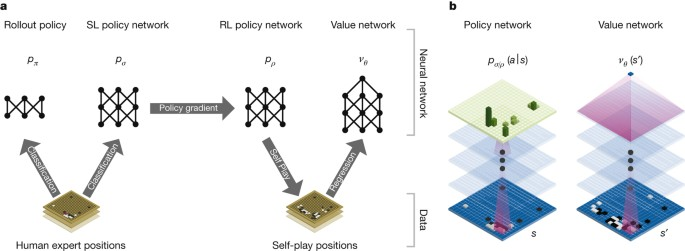

# _Unsupervised Learning_

O aprendizado não-supervisionado nos possibilita aproximar problemas que temos pouca ou nenhuma
ideia de como seus resultados devem ser. Nós podemos derivar esta estrutura utilizando o método
de _clustering_ nos dados baseados nos relacionamentos com as variáveis nos dados

Podemos exemplificar a técnica de _clustering_ da seguinte forma: ao pegar uma coleção de um milhão
de genes diferentes, encontramos uma forma de agrupá-los, de modo que os genes de cada grupo
compartilhem determinada semelhança, como por exemplo, tempo de vida, localização, funções, etc.

Recentemente, foi desenvolvido pela DeepMind uma inteligência artificial que joga o jogo Go no
mais alto nível de performance. AlphaGo [[19]](../../referencias.md) combina diferentes técnicas de redes neurais profundas
para realizar o treinamento. Uma rede neural escolhe o melhor movimento a ser realizado a partir
de um estado de tabuleiro e a outra realiza uma previsão do vencedor do jogo através de modelos
probabilísticos. Utiliza-se de métodos de _unsupervised learning_ como por exemplo _reinforcement learning_
e _Monte Carlo Search_ que escolhe a melhor jogada a partir de jogadas prévias. Na Figura 2
está representado um modelo de _unsupervised learning_ utilizado na implementação do AlphaGo.

  

(a) Banco de dados MNIST para reconhecimento de dígitos manuscritos. Muito usado em sistemas de
processamento de imagens. Essa base de dados foi usada para a implementação de um algoritmo de reconhecimento
de dígitos manuscritos com a utilização de redes neurais

  

(b) Representação de uma das funções da inteligência GPT-2 desenvolvida pela OpenAI (2019), onde a partir de
um texto de entrada. É uma inteligência que foi treinada para traduzir textos, responder perguntas, resumir
passagens de textos e gerar um texto de saída que se assemelha com o nível de escrita humano.

Figura 1

  

Figura 2: Representação dos da arquitetura dos métodos de aprendizado implementados para o AlphaGo. Percebe-se
que foram utilizados métodos de <i>supervised learning</i> e <i>unsupervised learning</i> a fim de definir a
melhor possível jogada dentre as milhões possibilidades a partir de um dado estado de jogo.

