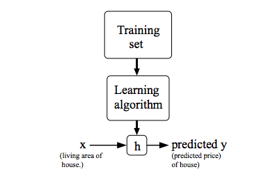

# Representação de modelos

A fim de representação futura, podemos utilizar a notação \\( x ^{(i)} \\) para denotar as variáveis de entrada
(_input_) e \\( y ^{(i)} \\) para denotar as variáveis de saída (_output_). O par \\( (x ^{(i)}, y ^{(i)}) \\) é chamado de exemplo
de treino e o conjunto de dados (_dataset_) que está sendo utilizado para análise é uma lista com \\( m \\)
exemplos de treino \\( (x ^{(i)}, y ^{(i)}); i=1, \dots m \\) chamado conjunto de treino (_training set_).

Podemos usar essa notação para descrever o método de aprendizado supervisionado de uma forma
mais formal, na qual, dado um _training set_, aprender uma função \\( h:X \rightarrow Y \\) de forma que
\\( h(x) \\) seja um "bom" preditor para o valor correspondente de \\( y \\). Historicamente, a função
\\( h \\) é conhecida como hipótese (_hypothesis_). Podemos analisar a seguinte definição através da Figura 3.

  

Figura 3: Processo de treino utilizando Supervised Learning. Dado um conjunto de treino como entrada, o nosso
algoritmo de aprendizado tenta prever um valor \( y \) de saída que tenha relação com o valor \( x \) de entrada.
Essa previsão é calculada através da função hipótese \( h \).

