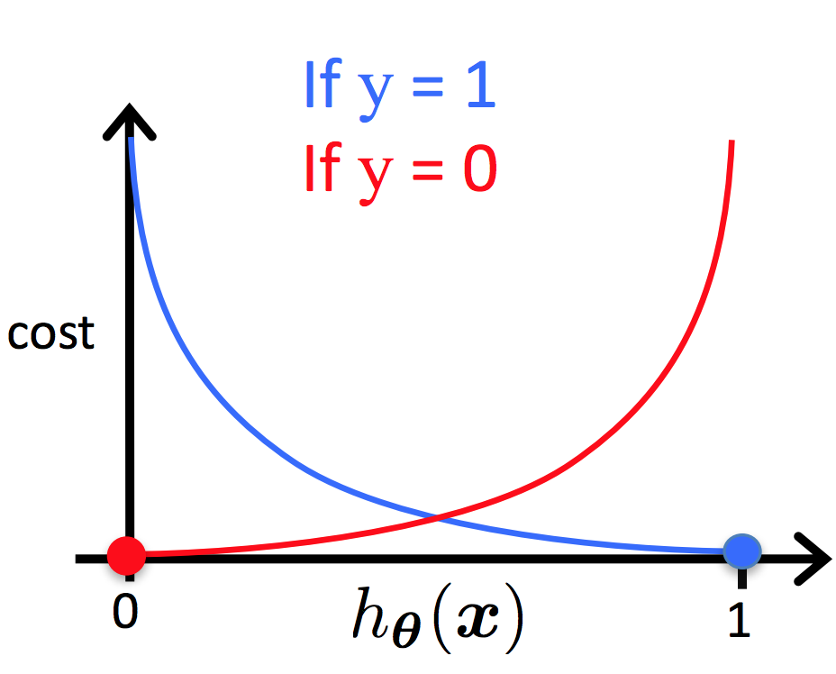

# Função Custo (_Cost Function_)

Nas seções anteriores, discutimos a implementação da função custo para a regressão linear. Entretanto,
para a regressão logística, utilizaremos uma função hipótese voltada para os problemas de
classificação. Na Figura 10 está representada a função logística que será utilizada para calcular a
hipótese do problema. Essa função gera valores probabilísticos no intervalo \\( [0,1] \\) e, com isso,
podemos calcular o valor da função custo de forma que possamos comparar a probabilidade da nossa
hipótese ser igual a 1 com o resultado \\( y \\) esperado.

Para realizar essa comparação, devemos realizar algumas manipulações algébricas de forma que
possamos definir uma função \\( J(\theta) \\) que calcule o custo. Abaixo, está descrita a intuição dessa
manipulação.

\\[
  \large{} J(\theta) = \frac{1}{m} \sum _{i=1} ^m Cost(h _{\theta}(x ^{(i)}), y ^{(i)})
\\]

\\[
  \large{} Cost(h _{\theta}(x ^{(i)}), y) = - \log (h _{\theta}(x)) \\ se \\ y=1
\\]

\\[
  \large{} Cost(h _{\theta}(x ^{(i)}), y) = - \log (1 - h _{\theta}(x)) \\ se \\ y=0
\\]

Dessa forma, podemos ter duas diferentes funções para a representação da função custo para a
regressão logística. Como podemos ver na Figura 12 temos duas representações, para \\( y=1 \\) em azul
e para \\( y=0 \\) em vermelho.

  

Figura 12: Representação da função custo da regressão logística

\\[
  \large{} Cost(h _{\theta}(x ^{(i)}), y) = 0 \\ \\ se \\ \\ h _{\theta}(x) = y
\\]

\\[
  \large{} Cost(h _{\theta}(x ^{(i)}),y) \rightarrow \infty \\ \\ se \\ \\ y=0 \\ \\ e \\ \\ h _{\theta}(x) \rightarrow 1
\\]

\\[
  \large{} Cost(h _{\theta}(x ^{(i)}),y) \rightarrow \infty \\ \\ se \\ \\ y=1 \\ \\ e \\ \\ h _{\theta}(x) \rightarrow 0
\\]

Podemos perceber que quando o valor da função custo é zero, então o valor da função hipótese é
igual a \\( y \\). Além disso, quando a função custo tende ao infinito e o valor de \\( y \\) é igual a zero, o valor
da função hipótese tende a um e se o valor de \\( y \\) é igual a um, a função hipótese tende a zero.

A fim de simplificar a função custo, podemos reescrevê-la da seguinte forma sem alterar o valor do
resultado:

\\[
  \large{} Cost(h _{\theta}(x),y) = -y \cdot \log (h _{\theta}(x)) - (1-y) \cdot \log (1-h _{\theta}(x))
\\]

Com isso, podemos generalizar a função custo de acordo com a expressão abaixo:

\\[
  \large{} J(\theta)=- \frac{1}{m} \sum _{i=1} ^m
    \Big[ y ^{(i)} \cdot \log (h _{\theta}(x ^{(i)})) + (1-y ^{(i)}) \cdot \log (1-h _{\theta}(x ^{(i)})) \Big]
\\]
