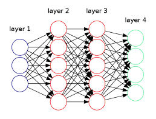

# Classificação Multiclasse

Em problemas que são utilizados redes neurais, comumente são utilizados métodos de resolução
desses problemas de forma multiclasse. Em outras palavras, a rede neural não terá apenas uma
função hipótese como saída, \\( h _{\Theta}(x) \\) nesses casos será um vetor que pertence a
\\( \mathbb{R} ^n \\).

Na Figura 18 abaixo podemos perceber que a rede neural foi construída com o objetivo de resolver
um problema de classificação multiclasse, pois percebemos que a camada verde, abaixo ("_layer 4_"),
que representa a função hipótese, é um vetor que pertence a \\( \mathbb{R} ^4 \\)

  

Figura 18: Representação de uma rede neural com classificação multiclasse

É possível escrever um programa de visão computacional para que possamos diferenciar pedestres,
carros, motos e caminhões. Assim, teremos quatro nodos na output layer que representam cada um
dos tipos de automóveis descritos.

\\[
  \large{} h _{\Theta}(x) ^1 \approx
    \begin{bmatrix}
      1 \\\\ 0 \\\\ 0 \\\\ 0
    \end{bmatrix}
    , \\
    h _{\Theta}(x) ^2 \approx
    \begin{bmatrix}
      0 \\\\ 1 \\\\ 0 \\\\ 0
    \end{bmatrix}
    , \\
    h _{\Theta}(x) ^3 \approx
    \begin{bmatrix}
      0 \\\\ 0 \\\\ 1 \\\\ 0
    \end{bmatrix}
    , \\
    h _{\Theta}(x) ^4 \approx
    \begin{bmatrix}
      0 \\\\ 0 \\\\ 0 \\\\ 1
    \end{bmatrix}
\\]

Onde \\( h _{\Theta}(x) ^1 \\) representa um pedestre, \\( h _{\Theta}(x) ^2 \\) representa um carro,
\\( h _{\Theta}(x) ^3 \\) representa uma moto e \\( h _{\Theta}(x) ^4 \\) representa um caminhão.
Dessa forma, a rede neural poderia ser modelada, em forma vetorial, da seguinte forma:

\\[
  \large{}
    \begin{bmatrix}
      x _0 \\\\ x _1 \\\\ x _2 \\\\ \dots \\\\ x _n
    \end{bmatrix}
      \rightarrow
    \begin{bmatrix}
      a _0 ^{(2)} \\\\ a _1 ^{(2)} \\\\ a _2 ^{(2)} \\\\ a _3 ^{(2)} \\\\ \dots
    \end{bmatrix}
      \rightarrow
    \begin{bmatrix}
      a _0 ^{(3)} \\\\ a _1 ^{(3)} \\\\ a _2 ^{(3)} \\\\ a _3 ^{(3)} \\\\ \dots
    \end{bmatrix}
      \rightarrow
    \dots
      \rightarrow
    \begin{bmatrix}
      h _{\Theta}(x) _1 \\\\ h _{\Theta}(x) _2 \\\\ h _{\Theta}(x) _3 \\\\ h _{\Theta}(x) _4
    \end{bmatrix}
\\]
