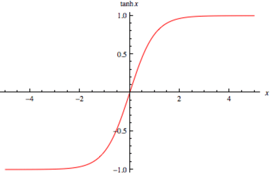

# Camada de ativação: _Hyperbolic tangent_

A função _hyperbolic tangent_, ou \\( tanh \\) é muito similiar a função de ativação _softmax_. Essa função é
muito utilizada redes neurais recorrentes (Seção
[Redes neurais recorrentes (_Recurrent neural networks_)](../../parte-6/2/6-2.md)), especialmente nas arquiteturas GRU e LSTM.
A função \\( tanh \\) tem a seguinte estrutura:

---

\\[
  \large{} y=tanh(z)= \frac{e ^z - e ^{-z}}{e ^z + e ^{-z}}
\\]

---

Assim como a _softmax_, a função \\( tanh \\) também gera valores entre -1 e 1, como percebemos na
Figura 21, porém não gera a distribuição para \\( K \\) valores de classe.

  

Figura 21: Representação da função \( tanh \) usada para a camada de ativação

