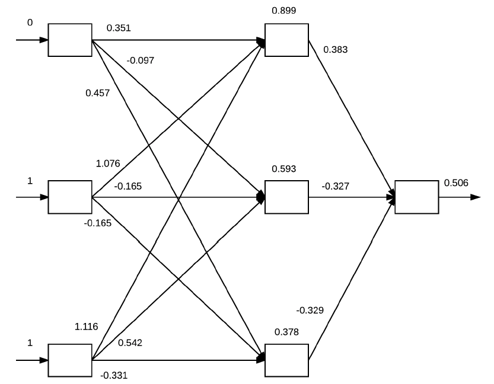

# _Forward pass_

O principal objetivo dessa fase é calcular os valores de cada neurônio da nossa rede neural aplicando
uma série de _dot products_ (multiplicações entre vetores) e funções de ativação a fim de atingirmos
a camada final da rede.

Por exemplo, se temos os seguintes valores de entrada \\( x _i \\) e a saída esperada \\( y \\), de acordo com a
tabela a seguir:

Tabela 3: Valores hipotéticos de entrada para a rede neural seguindo uma tupla do tipo \( (x, y) \)

| \\( x _0 \\) | \\( x _1 \\) | \\( x _2 \\) **(_bias_)** | \\( y \\) |
|:------------:|:------------:|:-------------------------:|:---------:|
| 0            | 0            | 1                         | 0         |
| 0            | 1            | 1                         | 1         |
| 1            | 0            | 1                         | 1         |
| 1            | 1            | 1                         | 0         |

Cada um desses valores de \\( x _i \\) estarão presentes na *input layer* da rede neural. E para cada um desses
valores, serão realizados _dot products_ entre as entradas de cada camada seguido pelo cálculo da
função de ativação. Esta ideia está exemplificada na Figura 22 a seguir.

  

Figura 22: Exemplificação do algoritmo <i>backpropagation</i> a partir dos inputs definidos na Tabela 3. Na <i>input layer</i>
estão os valores de \( x \) definidos. Os valores das arestas são inicializados aleatoriamente e representam os pesos. Na
<i>hidden layer</i> estão os valores calculados a partir dos <i>dot products</i> e das aplicações das funções de ativação (neste
caso, sigmoide) e na <i>output layer</i> o valor calculado pela função custo.

A partir dos valores de entrada baseados na Tabela 3 e os pesos que foram inicializados aleatoriamente,
para cada um desses valores executamos as seguintes operações de _dot products_ e ativações utilizando
a função \\( g(z) \\) sigmoide:

1. \\( g((0 \times 0.351) + (1 \times 1.076) + (1 \times 1.116)) = 0.899 \\)

2. \\( g((0 \times 0.097) + (1 \times 0.165) + (1 \times 0.542)) = 0.593 \\)

3. \\( g((0 \times 0.457) + (1 \times 0.165) + (1 \times 0.331)) = 0.378 \\)

Os valores dos neurônios das _hidden layers_ são atualizados de acordo com essas operações e, com
eles podemos aplicar mais uma vez as mesmas operações para cada um dos valores atualizados para
gerarmos o valor da _output layer_.

\\[
  \large{}
    g((0.899 \times 0.383) + (0.593 \times -0.327) + (0.378 \times -0.329)) = 0.506
\\]

A saída é, portanto, \\( 0.506 \\), o que representa um valor de probabilidade de 50,6%. Contudo,
percebe-se que a rede neural não tem muita confiança a respeito do valor gerado, então, para que a rede
neural realmente aprenda precisamos realizar a minimização da função custo através da etapa de
_Backward pass_.
