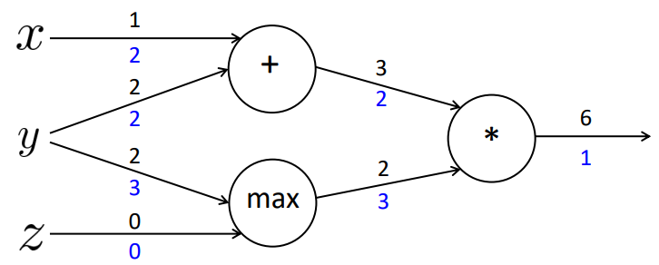

# _Backward pass_

Para otimizar a função custo, desejamos selecionar pesos que fornecem uma estimativa ótima de
uma função que modela nossos dados de treinamento. Ou seja, desejamos encontrar um conjunto
de pesos \\( \Theta \\) que minimize a saída \\( J(\Theta) \\).

Para aplicar o algoritmo de _backpropagation_ a nossa função de ativação deve ser diferenciável, de
modo que possamos calcular a derivada parcial do erro em relação a um dado peso \\( \Theta ^{(L)} \\), o custo
\\( \mathcal{L} \\), saída do nó \\( a ^{(L)} \\) da *hidden layer* e saída da rede \\( z ^{(L)} \\).

---

\\[
  \large{} \frac{\partial \mathcal{L}}{\partial \Theta ^{(L)}} =
    \frac{\partial z ^{(L)}}{\partial \Theta ^{(L)}} \frac{\partial a ^{(L)}}{\partial z ^{(L)}}
    \frac{\partial \mathcal{L}}{\partial a ^{(L)}}
\\]

---

A saída dessa equação é uma função composta dos pesos, entrada e funções de ativação.

Podemos analisar cada um desses termos separadamente.

\\[
  \large{} \frac{\partial \mathcal{L}}{\partial a ^{(L)}} = 2(a ^{(L)}-y), \\ \\
    \frac{\partial a ^{(L)}}{\partial z ^{(L)}} = g'(z ^{(L)}), \\ \\
    \frac{\partial z ^{(L)}}{\partial \Theta ^{(L)}} = a ^{(L-1)}
\\]

Então, seguindo o exemplo da Figura 22, a partir do valor de saída, iremos calcular a derivada da
respectiva camada baseando-se em relação aos pesos que nela estão conectados. Essa derivada é
uma composição de multiplicações de derivadas do custo calculado em relação a camada anterior, a
camada anterior em relação a saída da rede neural e a saída da rede neural em relação aos pesos.

Com isso, podemos minimizar o erro dos pesos seguindo a seguinte ideia:

\\[
  \large{} Novo \\ Peso = Peso \\ Antigo - Derivada \times Taxa \\ de \\ aprendizado
\\]

Para o caso de uma camada de uma rede neural, nós temos uma função com \\( n \\) entradas (número
de neurônios da *input layer*) e \\( m \\) saídas (número de neurônios da *output layer*). Então, este é o
caso que teremos uma matriz de derivadas parciais que se refere ao Jacobiano. Um Jacobiano é uma
matriz de derivadas parciais \\( mxn \\), em outras palavras

\\[
  \large{}
    \frac{\partial \mathbf{f}}{\partial \mathbf{x}} =
    \begin{bmatrix}
      \frac{\partial f _1}{\partial x _1} && \cdots && \frac{\partial f _1}{\partial x _n} \\\\
      \vdots && \ddots && \vdots \\\\
      \frac{\partial f _m}{\partial x _1} && \cdots && \frac{\partial f _m}{\partial x _n}
    \end{bmatrix}
      \rightarrow
    \Big( \frac{\partial \mathbf{f}}{\partial \mathbf{x}} \Big) _{ij} = \frac{\partial f _i}{\partial x _j}
\\]

Podemos exemplificar o cálculo das derivadas parciais pensando em um exemplo simples com operações
matemáticas. A Figura 23 a seguir representa uma rede de quatro camadas: camada de
entrada, com os valores \\( x, y \\) e \\( z \\), camada interna com operações soma (\\( + \\)) e \\( max \\),
camada interna com a operação multiplicação (\\( * \\)) e a camada de saída. Percebe-se que executamos a operação
\\( f=(x+y)*max(y,z) \\). Supondo que os valores das arestas são os valores retornados na saída de
cada camada, temos que o valor da função \\( f=6 \\).

  

Figura 23

Com isso podemos gerar três valores internos distintos que representam a função:

\\[
  \large{} a = x + y
\\]

\\[
  \large{} b = max(y,z)
\\]

\\[
  \large{} f = ab
\\]

onde \\( x=1, y=2 \\) e \\( z=0 \\).

Podemos realizar a _backpropagation_ nessa rede calculando as derivadas parciais de cada um dos
níveis a respeito ao nível anterior, como vimos anteriormente. Para isso, para facilitar a compreensão,
calculamos as derivadas parciais locais, da seguinte forma:

\\[
  \large{} \frac{\partial a}{\partial x} = 1, \\ \frac{\partial a}{\partial y} = 1
\\]

\\[
  \large{} \frac{\partial b}{\partial y} = 1(y \> z) = 1, \\
    \frac{\partial b}{\partial z} = 1(z \> y) = 0
\\]

\\[
  \large{} \frac{\partial f}{\partial a} = b = 2, \\ \frac{\partial f}{\partial b} = a = 3
\\]

\\[
  \large{} \frac{\partial f}{\partial f} = 1
\\]

Com esses valores definidos, podemos calcular a aplicação da regra da cadeia para atualizar os
valores internos dos nodos. Os valores representados em azul na Figura 24 são as multiplicações
das derivadas resultantes da função em relação ao estado atual com a derivada da função gerada no
estado imediatamente anterior.

  

Figura 24

Assim, geramos a seguinte atualização das derivadas da função em relação a cada uma das variáveis
de entrada:

\\[
  \large{} \frac{\partial f}{\partial x} = 2
\\]

\\[
  \large{} \frac{\partial f}{\partial y} = 3+2 = 5
\\]

\\[
  \large{} \frac{\partial f}{\partial z} = 0
\\]

Portanto, na prática, _backpropagation_ é apenas uma aplicação recursiva da regra da cadeia por toda
a rede neural baseando-se nos valores gerados das camadas mais finais até as camadas mais iniciais.
Em suma, _backpropagation_ das redes neurais é equivalente ao algoritmo de gradiente descendente
dos problemas de regressão.
