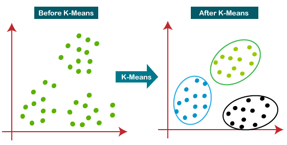

# _K-Means Algorithm_

_K-Means Algorithm_ é um dos algoritmos mais populares e são amplamente utilizados a fim de,
automaticamente, agrupar dados em subgrupos denominados _clusters_.

  

Figura 29: Representação de <i>clustering</i> através do algoritmo de <i>K-Means</i>. Percebe-se que, com a aplicação do
algoritmos os dados passam a formar conjuntos diferentes, na figura, representados pelas cores azul, verde e preto.

Antes de discutir o algoritmo, podemos discutir o funcionamento desse método de _machine learning_
para os três clusters da imagem acima.

1. Randomicamente inicializar três pontos no conjunto de dados. Esses pontos serão chamados
de _cluster centroids_;

2. Atribuição do _cluster_: atribua todos os exemplos em um dos três grupos baseado em qual
_centroid_ os exemplos estão mais próximos;

3. Mover os _centroids_: computar as médias de todos os pontos dentro de cada um dos três
_centroids_, e mover os _centroids_ para os pontos que representam as médias;

4. Executar os passos (2) e (3) até convergir.

Para o algoritmo, teremos as seguintes variáveis principais:

- \\( K \\): número de _clusters_;

- \\( x ^{(1)}, x ^{(2)}, \dots , x ^{(n)} \\): conjunto de treino, onde \\( x ^{(i)} \in \mathbb{R} ^n \\)

---

**Algorithm 8** Algoritmo _K-Means_

---

1: **procedure**

2: &emsp; Randomicamente inicializar \\( K \\) _cluster centroids_ \\( \mu _1, \mu _2, \dots , \mu _K \in \mathbb{R} ^n \\)

3: &emsp; **repeat**

4: &emsp;&emsp; **for** \\( i=1 \\) **to** \\( m \\) **do**

5: &emsp;&emsp;&emsp;
\\( c ^{(i)} := \\) índice (de 1 até \\( K \\)) do _cluster centroid_ mais perto de \\( x ^{(i)} \\)

6: &emsp;&emsp; **end for**

7: &emsp;&emsp; **for** \\( k=1 \\) **to** \\( K \\) **do**

8: &emsp;&emsp;&emsp;
\\( \mu _k := \\) média dos pontos atribuídos ao cluster \\( k \\)

9: &emsp;&emsp; **end for**

10:&emsp;**until** \\( convergir \\)

11: **end procedure**

---

No algoritmo, percebemos que existem dois _loops_. O primeiro, realiza a etapa (2) descrita acima da
seguinte forma:

\\[
  \large{} c ^{(i)} = argmin _k || x ^{(i)} - \mu _k || ^2 == || (x _1 ^i - \mu _{i(k)}) ^2 +
    (x _2 ^i - \mu _{2(k)}) ^2 + \dots ||
\\]

No segundo _loop_ realiza a etapa (3) e pode ser descrita da seguinte forma:

\\[
  \large{} \mu _k = \frac{1}{n} [x ^{(k _1)} + x ^{(k _2)} + \dots + x ^{(k _n)}]
\\]

Onde cada valor de \\( x ^{(k _1)},x ^{(k _2)}, \dots ,x ^{(k _n)} \\) são os exemplos de treino atribuidos
por \\( \mu _k \\)

Depois de um número de iterações, o algoritmo irá convergir e as posições dos _centroids_ não serão
mais alteradas.
