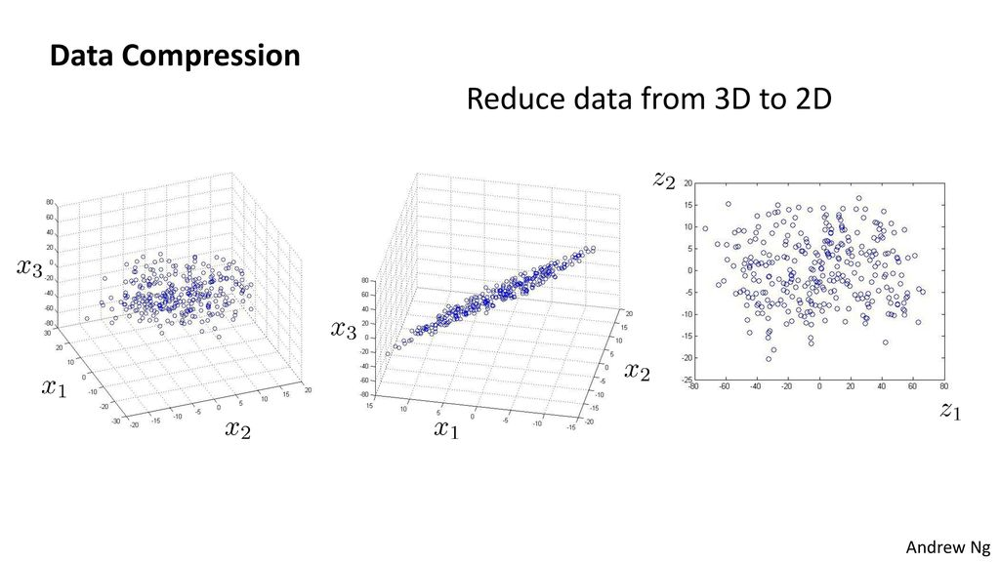

# Compressão de dados

Em um conjunto de dados, muitas vezes podemos ter diversos dados redundantes e, para isso,
devemos reduzir a quantidade desses dados a fim de facilitar a compreensão do conjunto o qual
estamos trabalhando.

Assim, nós selecionamos dados que estão correlacionados e os colocamos em uma única linha que
possa descrever o comportamento de ambos. Com redução de dimensionalidade, podemos reduzir o total
de dados guardados aumentando a memória disponível e, muitas vezes, acelerando o processamento do
algoritmo de aprendizagem.

  

Figura 32: Representação de uma compressão de dados. Na figura, percebe-se que houve a redução na
dimensionalidade dos dados. Os dados previamente em três dimensões foram convertidos para duas dimensões. Essa
conversão se dá através de um algoritmo que será apresentado nas seções seguintes chamado PCA.

