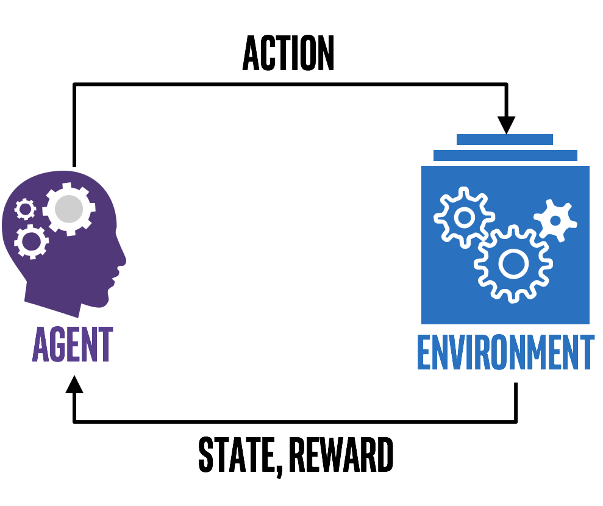

# Visão geral

Nesta seção será apresentado mais um método de aprendizado de máquina chamado aprendizado por
reforço (do inglês, _Reinforcement Learning_ ou RL). RL ensina um agente a como escolher uma ação
que faça sentido de acordo com o ambiente que ele esteja inserido (e.g. escolher uma movimentação
de peça adequada em um jogo de tabuleiro) a fim de maximizar a recompensa que esse agente recebe
ao longo do tempo.

Para isso, precisamos definir alguns elementos essenciais para a implementação de um algoritmo de
RL (representado na Figura 34).

- Agente: o que o programa está exatamente treinando a fim de realizar alguma tarefa específica;

- Ambiente: o mundo, real ou virtual, no qual o agente realiza as suas ações;

- Ação: um movimento realizado pelo agente. Essa movimentação muda o estado do ambiente;

- Recompensa: a valoração de uma ação realizada pelo agente. Essa valoração pode ser positiva
ou negativa.

  

Figura 34: Representação de um esquema básico de um algoritmo de RL. Percebe-se que o agente através de ações
realizadas sobre um ambiente determinado atualiza o estado do ambiente e recebe recompensas (positivas ou
negativas) de acordo com a ação realizada.

Com essas definições, percebe-se que o processo de aprendizado do agente se dá por meio de tomada
de decisões baseadas no ambiente e nas recompensas. Na próxima seção será apresentada as ideias
fundamentais de exploração do ambiente em RL.
