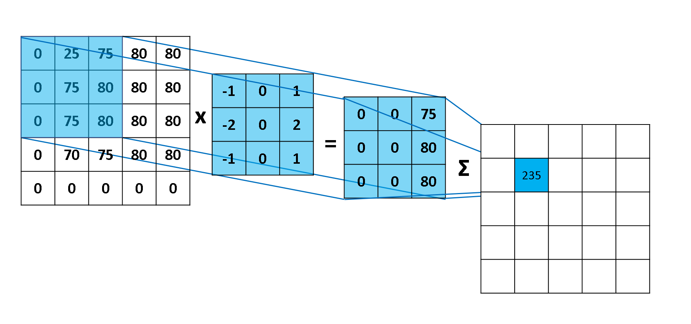

# Camadas de uma ConvNet

Como foi descrito acima, uma ConvNet é uma sequência de camadas que transforma um volume
de ativações em outro através de uma função de diferenciação. Para isso, utilizamos camadas
específicas para realizar o treinamento de uma ConvNet, dentre elas: _Convolutional layer_,
_Pooling layer_ e _Fully-connected layer_. Esta última, exatamente como uma rede neural regular.

A principal diferença entre uma _dense layer_ e uma _convolutional layer_ é que as camadas densas
detectam padrões globais, enquanto camadas convolucionais detectam padrões locais.

Para a melhor compreensão será utilizado um exemplo CIFAR-10 [[1]](../../referencias.md) o qual consiste em uma base
de dados com 60 mil imagens de tamanho 32x32 separadas em 10 classes. O conjunto de dados é
separado em 50 mil para usado para treino e 10 mil para teste.

Uma ConvNet para classificar as imagens de CIFAR-10 tem a seguinte estrutura, detalhada abaixo:

- _Input_ [32x32x3]: recebe um vetor dos valores dos _pixels_ da imagem. Neste caso a imagem
tem largura 32, altura 32 com três canais de cores (RGB);

  

Figura 44: Representação de uma camada de <i>input</i> de uma rede neural convolucional. Podemos perceber, que na
imagem representada temos uma imagem de tamanho 4x4 com três canais de cores RGB e cada valor de cada pixel
corresponde a um valor em cada uma dessas escalas de cores.

- _Conv Layer_: computa a saída dos neurônios que estão conectados a regiões de entrada. Cada
um computa um produto escalar entre os pesos e a uma região as quais eles estão conectados
no volume de entrada. Isso pode resultar em um volume como [32x32x12] se desejarmos
utilizar 12 filtros _kernel_. Este filtro possui um tamanho que varre a imagem através de
_strides_ - distância entre duas varreduras do filtro - gerando uma nova imagem de mesmo tamanho,
porém com esse filtro aplicado;

  

Figura 45: Representação da utilização de um filtro (<i>kernel</i>) para mapear os valores da imagem dada como entrada.
Percebe-se que o filtro utilizado mantém as bordas da imagem de entrada.

  

Figura 46: Representação das operações realizadas por um filtro a partir de uma imagem. O filtro (3x3) multiplica os
valores da imagem (5x5) pelos seus respectivos valores até gerar uma saída correspondente de tamanho 3x3. Esses
valores retornados são somados e adicionados ao respectivo pixel da imagem (5x5) camada seguinte com o filtro
aplicado.

- _ReLU Layer_: computa a função de ativação;

- _Pool Layer_: computa uma operação de redução da resolução ao longo das dimensões,
resultando em um volume como [16x16x12];

  

Figura 47: Representação de uma operação de <i>pooling</i>. Na figura, utiliza-se o método de <i>max-pooling</i> com um filtro
de tamanho 2x2 o qual escolhe o maior valor do pixel que se encontra dentro do filtro.

- _FC Layer_: computa as pontuações das classes, resultando em um volume de tamanho [1x1x10],
onde cada um dos 10 números representa uma categoria da base de dados CIFAR-10

Abaixo, na Figura 48 está representado, esquematicamente uma ConvNet voltada para a base de
dados CIFAR-10. Nela, percebemos as operações que foram realizar ao longo do processamento de
convolução e de aprendizado da classificação.

  

Figura 48: Representação de uma ConvNet para a base de dados CIFAR-10

Além disso, uma camada de convolução de uma ConvNet recebe alguns outros parâmetros que serão
descritos a seguir:

- Aceita um volume de tamanho: \\( W _1 \times H _1 \times D _1 \\);

- Requer quatro hiperparâmetros:

  1. Número de filtros (_kernels_): \\( K \\)

  2. Tamanho do filtro: \\( F \\)

  3. _Stride_ (distância entre duas posições consecutivas do filtro): \\( S \\)

  4. Tamanho da borda (_zero-padding_): \\( P \\)

- Produz um volume de: \\( W _2 \times H _2 \times D _2 \\) onde:

  - \\( W _2 = \frac{(W _1 - F + 2P)}{S + 1} \\)

  - \\( H _2 = \frac{(H _1 - F + 2P)}{S + 1} \\)

  - \\( D _2 = K \\)

Geralmente, uma inicialização comum para esses parâmetros é \\( F=3 , \\ S=1 \\) e \\( P=1 \\), porém esses
parâmetros podem ser modificados de acordo com a intenção de treino da ConvNet.

Da mesma forma, uma camada de _pooling_ de uma ConvNet recebe alguns parâmetros a seguir
descritos:

- Aceita um volume de tamanho: \\( W _1 \times H _1 \times D _1 \\);

- Requer dois hiperparâmetros:

  1. Tamanho do filtro: \\( F \\)

  2. _Stride_: \\( S \\)

- Produz um volume de: \\( W _2 \times H _2 \times D _2 \\) onde:

  - \\( W _2 = \frac{(W _1 - F)}{S + 1} \\)

  - \\( H _2 = \frac{(H _1 - F)}{S + 1} \\)

  - \\( D _2 = D _1 \\)

Assim, percebemos que uma ConvNet é simplesmente uma lista de camadas que transformam um
volume de entrada (neste caso uma imagem) e um outro volume de saída (neste caso os valores das
classes).
