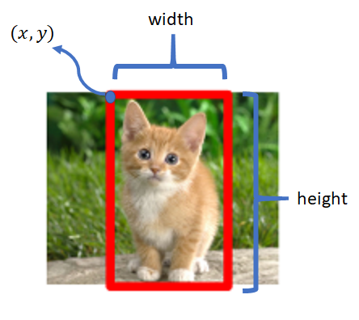

# Localização

Dada uma imagem, desejamos localizar onde está determinado objeto na imagem. Para isso, temos
dois tipos de localização: localização com apenas um objeto na imagem e localização com mais de
um objeto.

Podemos verificar como funciona a localização de objetos em imagens na Figura 52

  

Figura 52: Representação de uma localização de objetos. Percebemos que a partir de uma coordenada \( (x, y) \)
prevemos os valores da altura e da largura da <i>bounding box</i> que limita a figura do gato, neste caso.

Para o problema de localização de objetos, trataremos esse problema como um problema de regressão,
que dado uma coordenada \\( (x, y) \\) de uma _bounding box_, desejamos prever as outras coordenadas dessa
_bounding box_ de acordo com a classificação gerada pela ConvNet. Assim, o resultado da função de
localização será uma tupla do tipo \\( (x, y, w, h) \\) onde \\( x \\) e \\( y \\) são as coordenadas iniciais da
_bounding box_ e \\( w \\) e \\( h \\) são, respectivamente a largura e a altura da _bounding box_.
