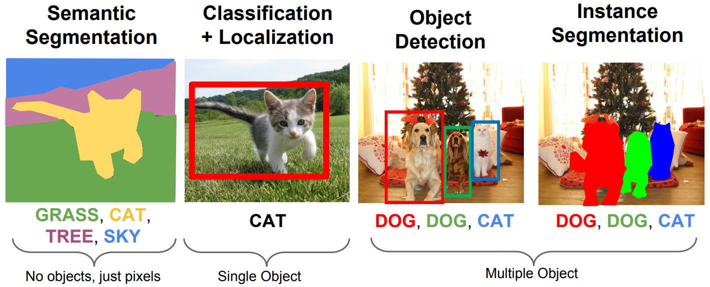

# Segmentação de Instâncias

Assim, como detecção de objetos, desejamos localizar e classificar objetos em uma dada imagem,
porém, além de apenas definir uma _bounding box_ para cada um dos objetos, desejamos segmentar a
imagem de acordo com cada objeto encontrado e classificá-los, como pode-se perceber na Figura 56

  

Figura 56: Comparação entre os diferentes tipos de detecção e segmentação de objetos em imagens.

