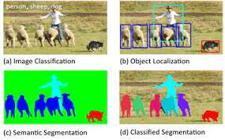

# Detecção e Segmentação

Detecção de objetivos é um problema multitarefa que usa algoritmos de classificação e localização a
fim de saber qual objeto é e qual a sua localização. Na Figura 49 temos uma representação de uma
imagem que os objetos presentes foram classificados e localizados.

  

Figura 49: Representação de uma imagem que seus objetos foram devidamente classificados e localizados. Em (a)
está representada a classificação da imagem, em (b) a localização dos objetos, em (c) a segmentação semântica da
imagem e em (d) a segmentação classificada dos objetos e suas determinadas localizações.

Este tipo de estudo é muito recorrente na área de visão computacional, principalmente usado para a
detecção de rostos através de imagens e em carros autônomos através de imagens e vídeos.
