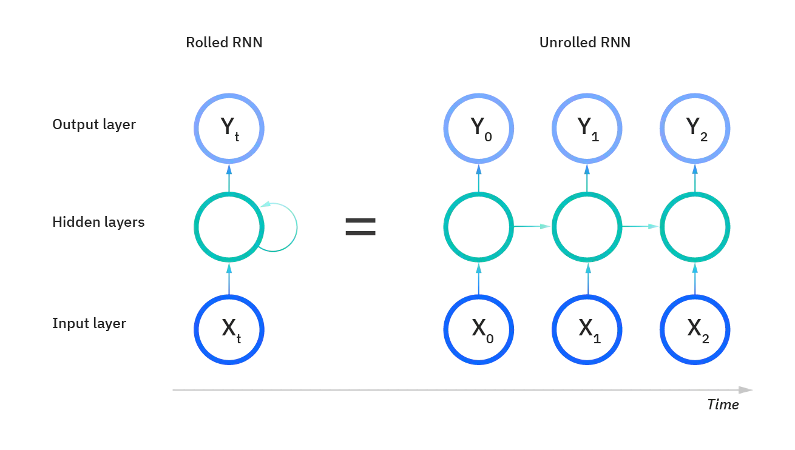

# Visão geral

Redes neurais recorrentes, ou RNNs, são um tipo de rede neurais que usam dados sequenciais ou
dados de séries temporais. Os algoritmos mais conhecidos utilizados estão relacionados a tradução
de linguagens, processamento de linguagem natural (_Natural Language Processing_ (NLP)),
reconhecimento de discursos e legenda de imagens.

Assim como _feedforward_ e redes neurais convolucionais, RNNs utilizam de dados de treino para
aprender, ou seja, é um tipo de aprendizagem supervisionada. A principal diferença de uma RNN é
que ela possui uma espécie de memória que guarda as informações prévias de input que influenciam
nas próximas camadas da rede neural (Figura 57). Além disso, RNNs dependem dos elementos
posteriores dentro da sequência.

  

Figura 57: Representação da comparação estrutural de umas rede neural recorrente e uma rede neural tradicional do
tipo <i>feedforward</i>.

Para representação de uma RNN podemos utilizar dois métodos: _rolled_ e _unrolled_ mostradas na
Figura 58.

  

Figura 58: Duas formas básicas de representação de uma RNN. A forma <i>rolled</i> representa a rede neural inteira,
focando apenas da saída. Na forma <i>unrolled</i> representa as camadas individuais com seus respectivos parâmetros.

Outra importante diferença em uma RNN em relação a uma rede neural do tipo _feedforward_ é que
no caso das RNNs, seus nodos compartilham dos mesmos parâmetros ao logo de cada camada da
rede, enquanto em uma rede _feedforward_ possui diferentes parâmetros (pesos) em cada nodo.
