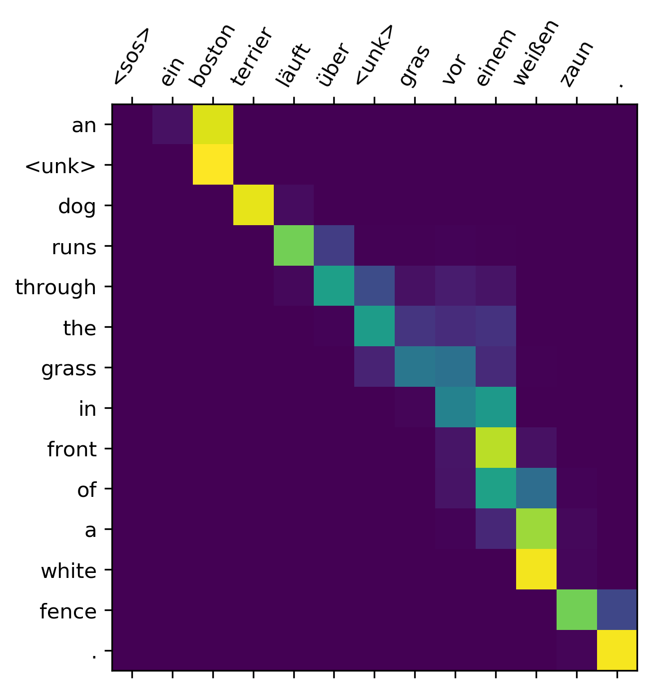

# Attention

Em problemas do tipo _seq2seq_, quando criamos um modelo de tradução de máquina que tem como
objetivo traduzir uma sentença geramos um problema chamado _bottleneck_ (Figura 75), o qual toda
a informação da sentença que desejamos traduzir fica acumulado na camada da última palavra
da sentença, devido ao processamento sequencial de uma RNN, possibilitando grande perda de
informações passadas e dificultando a tradução.

  

Figura 75: Exemplificação do problema de <i>bottleneck</i>, onde toda a informação da sequência que deseja ser traduzida
acaba ficando acumulada na camada da última palavra da sentença (retângulo laranja). Esse tipo de problema gera
impactos na tradução, principalmente para linguagens que não se relacionam linearmente.

Para resolver o problema mencionado acima, foram criadas técnicas para prestar atenção a palavras
específicas e influenciar a tradução a cada período de tempo. Por exemplo, quando traduzimos
uma frase, prestamos atenção na palavra que estamos querendo traduzir e validamos a tradução
baseando-se nas palavras anteriores e futuras. Uma RNN pode realizar isso, através de uma técnica
chamada _attention_.

Em uma RNN, ao invés de codificar toda a sentença um estado interno da rede neural, cada palavra
corresponde a um estado interno que é passado até o estágio de decodificação, como está representado
na Figura 76.

  

Figura 76: Representação de um processo de <i>encoding-decoding</i>. Percebe-se que os valores de \( x _i \) são os valores de
input de cada célula. Esses valores são codificados, gerando os valores \( c _i \), a fim de serem decodificados no final da
operação, gerando \( s _i \). Os valores gerados como saída baseado em cada um dos valores decodificados são os valores
de \( y _i \).

Contudo, um dos problemas dessa arquitetura é que, como para cada valor codificado a partir dos
valores de entrada, devemos gerar um único vetor \\( c \\), esse processo pode acarretar na perda de
informações importantes devido ao _bottleneck_.

Para resolver esse problema, utilizamos o método de _Attention_. Uma RNN utilizando esse método
está representada na Figura 77.

  

Figura 77: Representação de uma arquitetura de RNN utilizando <i>attention</i>. O módulo à esquerda representa o
mecanismo de <i>attention</i>.

O modelo com _Attention_ possui uma única camada de encoding, com 4 entradas \\( x _i \\) e com
4 saídas \\( h _i \\). O mecanismo de *attention* está localizado entre as camadas de *encoding* e *decoding*.
As entradas dessa camada são os vetores de saída \\( h _i \\) da camada de *encoding* e os vetores \\( s _i \\) dos estados do
*decoder*. E sua saída é uma sequência de vetores chamados vetores de contexto \\( c _i \\).

Os vetores de contexto possibilitam com que o _decoder_ foque em determinadas partes da entrada
quando está tentando prever a saída. Para o cálculo desses vetores, realizamos uma soma ponderada
dos valores \\( h _i \\) gerados pela camada de *encoding* com os pesos \\( a _i \\) gerados a partir do cálculo do grau
de relevância da entrada \\( x _i \\) sobre o output \\( y _i \\) no tempo \\( i \\). Em outras palavras:

\\[
  \large{} c _i = \sum _{j=1} ^i a _{ij} h _j
\\]

Os valores de \\( a _{ij} \\) são aprendidos por uma rede neural densa com uma camada de ativação *softmax*.

Para exemplificar o processo de _attention_ e como relaciona cada um dos estados nos processos
de _encoding-decoding_, podemos pensar na tradução da frase "L’accord sur la zone économique
européenne a été signé en août 1992.", em francês para o inglês, como está representado na Figura 78.

  

Figura 78: Representação de um processo de tradução da frase "An &lt;unk&gt; dog runs through the grass in front of a
white fence" para o alemão. Os pixels mais amarelados representam o quanto de atenção foi prestado a cada etapa da
tradução.

Como visto, o método de _attention_ aumentou significantemente a performance técnicas de _Neural Machine Translation_
(NMT), devido ao fato de possibilitar que o _decoder_ foque apenas em determinadas
partes da sequência. Além disso, resolve o problema _bottleneck_, pois possibilita que o decoder
olhe diretamente para a sentença que deve ser traduzidas.

Contudo, apesar da alta significância dessa técnica, ainda não conseguimos resolver o problema de
processarmos os dados de entrada em paralelo. Para uma entrada longa, o tempo de processamento
dessa técnica é aumentado significativamente.
