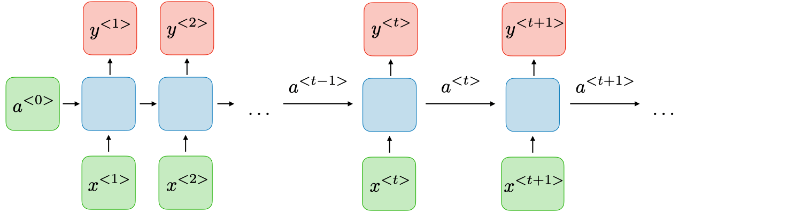

# Arquitetura de uma RNN

Como foi explicado na Seção [Visão geral](./6-2-1.md), uma RNN é uma classe de redes neurais que permite que as
saídas anteriores sejam usadas como entradas, embora tenham estados ocultos. Com isso podemos
determinar uma arquitetura básica desse tipo de rede neural e definir os seus parâmetros e suas
funções de ativação que podem ser, potencialmente, utilizadas.

  

Na Figura 65 está representada uma estrutura básica de uma RNN. Nela, para cada pedaço de tempo
\\( t \\), a ativação \\( a ^{\<t\>} \\) e a saída \\( y ^{\<y\>} \\) são expressos da seguinte forma:

---

\\[
  \large{} a ^{\<t\>} = g _1 (W _{aa} a ^{\<t-1\>} + W _{ax} x ^{\<t\>} + b _a)
\\]

---

\\[
  \large{} y ^{\<t\>} = g _2 (W _{ya} a ^{\<t\>} + b _y)
\\]

---

Onde \\( W _{ax}, \\ W _{aa}, \\ W _{ya}, \\ b _a, \\ b_y \\) são coeficientes que são temporariamente compartilhados
e \\( g _1 \\) e \\( g _2 \\) são as funções de ativação.

Os prós e contras de uma RNN estão descritos abaixo:

Tabela 5: Comparação entre os prós e contras de uma RNN

| Prós  | Contras   |
|---    |---        |
|Possibilidade de processamento de entrada de qualquer tamanho|Computação lenta|
|O tamanho do modelo não aumenta de acordo com o tamanho da entrada|Dificuldade de acessar informações de tempo muito distante|
|A computação leva em consideração informações históricas|Não consegue levar em consideração nenhuma entrada futura para o atual estado|
|Os pesos são compartilhados ao longo do tempo |  |
