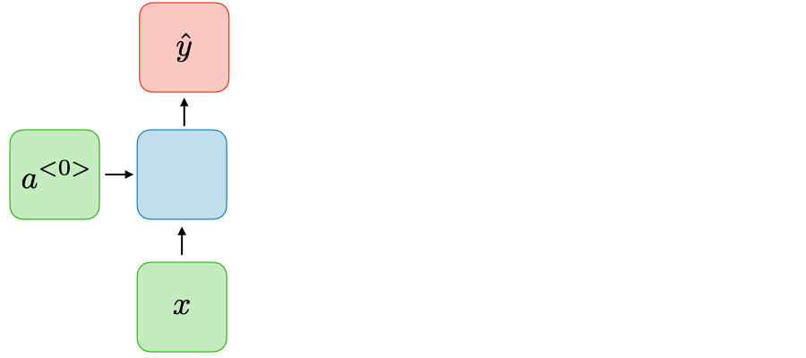

# _One-to-one_

O tipo de RNN _one-to-one_ é uma rede neural muito simples, na qual \\( T _x = T _y = 1 \\). Esse tipo de
RNN é muito utilizada em redes neurais tradicionais vistas anteriormente.

  

Figura 66: Representação de uma RNN do tipo <i>one-to-one</i>.

