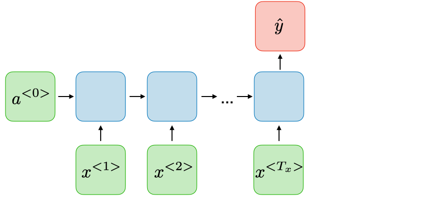

# _Many-to-one_

O tipo de RNN _many-to-one_ é uma rede neural, na qual \\( T _x \> 1 , \\ T _y = 1 \\). Esse tipo de RNN é muito
utilizada em classificação de sentimento.

  

Figura 68: Representação de uma RNN do tipo <i>many-to-one</i>.

