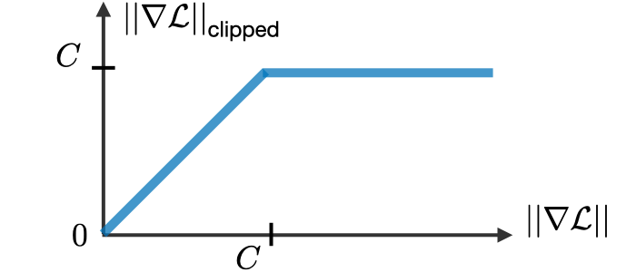

# Gradiente de desaparecimento e explosão

Esse fenômeno ocorre quando o gradiente, no contexto das RNNs, não consegue calcular valores
profundos da rede neural devido às sucessivas multiplicações. Muitas vezes essas multiplicações
podem ser exponenciais, decrementando ou incrementando, os valores dos parâmetros de acordo
com o número de camadas da rede neural.

O principal problema gerado pelo desaparecimento/explosão do gradiente é que a RNN não consegue
guardar as informações vistas em camadas muito anteriores da sequência, pois muitos valores estarão
zerados ou NaNs.

A fim de evitar o problema de explosão, usa-se a técnica de ”recorte do gradiente” (_gradient clipping_)
na qual limita o valor do gradiente calculado a fim de evitar explosões que eventualmente podem
ocorrer na _backpropagation_. Este método está representado na Figura 71.

  

Figura 71: Representação da técnica de ”recorte do gradiente”. No eixo <i>y</i> está representado o valor do gradiente após
a realização do corte de acordo com o crescimento do valor do gradiente, representado no eixo <i>x</i>.

Outra metodologia abordada para evitar o problema de dificuldade de memorização foi a criação de
portões de memorização, utilizados em arquiteturas que serão vistas na seção a seguir, como GRUs
e LSTMs.
