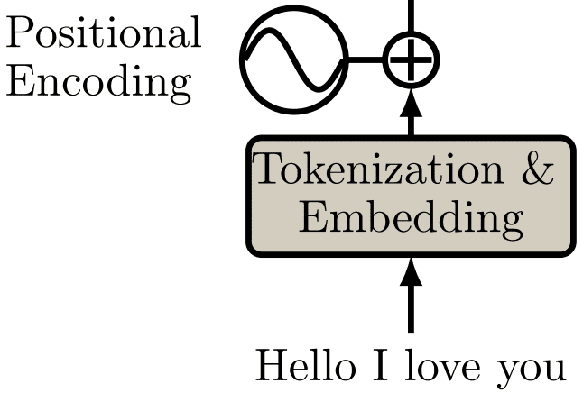

# _Positional encoding_

Quando processamos as palavras em forma de tokens, o nosso modelo perde a noção de ordem das
palavras devido ao fato de processar esse conjunto de uma vez só. Com isso, antes de processarmos
as informações das sequências na camada de _self-attention_, precisamos fazer com que o modelo passe
a compreender ordem novamente.

Por exemplo, se duas palavras iguais aparecem em lugares diferentes na mesma sentença, provavelmente
o sentido semântico delas é diferente. Para esse tipo de problema, o método de _positional encoding_
é muito eficiente, pois irá tratar palavras iguais de maneiras diferentes dependendo da ordem em que elas aparecem.

Na Figura 82 abaixo está representada a camada de positional encoding.

  

Figura 82: Representação da camada de <i>positional encoding</i>. Percebe-se que, dada uma sequência, ela é processada
através de tokenização e <i>embedding</i> e enviada para uma etapa onde acontece a soma entre uma função sinusoidal e o
resultado da camada anterior, gerando uma nova representação semântica para cada uma das palavras.

A função sinusoidal é utilizada para capturar informações relativas às posições das palavras e, com
isso, diferenciar semanticamente palavras iguais que possuem sentidos semânticos diferentes. Abaixo,
está descrita a equação de _positional encoding_ e será discutida a seguir.

\\[
  \large{} PE(pos, 2i) = \sin \Big( \frac{pos}{10000 ^{\frac{2i}{d}}} \Big)
\\]

A equação de _positional encoding_ recebe dois argumentos: \\( pos \\) e \\( i \\). O primeiro argumento
\\( pos \\) representa a posição que a palavra que está sendo prestada atenção ocupa. A variável \\( d \\) é o tamanho
do vetor de _embedding_ gerado. O segundo argumento \\( i \\) representa a \\( i \\)-ésima posição do vetor de
_embedding_.

\\[
  \large{} PE(pos, 2i + 1) = \cos \Big( \frac{pos}{10000 ^{\frac{2i}{d}}} \Big)
\\]
