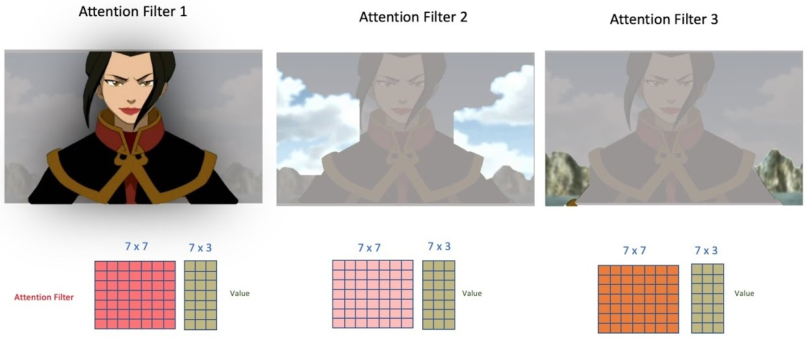
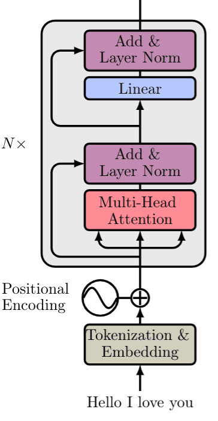

# _Multi-head attention_ e geração da saída

Na seção anterior, definimos apenas uma das cabeças do mecanismo de _multi-head attention_. Agora,
precisamos gerar a saída para as outras cabeças.

Essas outras cabeças são necessárias para focar em outros elementos da sentença, ou, no caso do
exemplo, em outros elementos da imagem.

  

Figura 85: Exemplificação do mecanismo de <i>multi-head attention</i> com os filtros aplicados em diferentes na mesma
imagem, porém, focando em diferentes elementos.

Definimos o mecanismo de _multi-head attention_ da seguinte forma:

---

\\[
  \large{} MultiHead (Q,K,V) = Concat(head _1 , \dots , head _h) W ^O
\\]

---

onde \\( W ^O \\) são os pesos da _linear layer_ de saída e
\\( head _i = Attention (QW _i ^Q , KW _i ^K , VW _i ^V) \\).

No final da camada de _multi-head attention_ concatenamos essas três matrizes geradas com o filtro
aplicado. Depois, através de conecções residuais (_residual skip connections_ [[8]](../../referencias.md)),
normalizamos a matriz de saída através do método de _layer normalization (LN)_ [[3]](../../referencias.md)
e geramos o saída através de uma _linear layer_.
Na Figura 86 a seguir, podemos visualizar a estrutura de um _encoder_ de um _transformer_.

  

Figura 86: Representação da estrutura de um <i>encoder</i> de um <i>transformer</i>.

Por fim, para gerar o resultado da saída do modelo, devemos passar esses dados gerados na camada
de _encoding_ para a camada de _decoding_.
