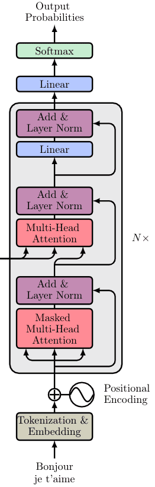

# _Decoder_

O decoder consiste nos mesmos componentes do _encoder_ com exceção de dois. Como visto
anteriormente:

1. A sequência de saída é computada da mesma forma através de _embedding_ e _positional encoding_

2. Esses vetores são passados para o primeiro bloco de _decoder_

Cada bloco de _decoder_ contém as seguintes estruturas:

1. Uma camada de _Mask Multi-head Attention_

2. Uma camada de normalização juntamente com uma conexão residual

3. Uma nova camada de _multi-head attention_ conhecida como _Encoder-Decoder attention_

4. Uma nova camada de normalização seguida por conexões residuais

5. Uma _linear layer_ com uma terceira conexão residual

Assim, a estrutura do _decoder_ está representada a seguir.

  

Figura 87: Representação da estrutura de um <i>decoder</i> de um <i>transformer</i>.

Na saída, _"Output Probabilities"_ representa a probabilidade do próximo _token_ da sequência.

Nas seções seguintes, serão detalhadas as subestruturas do _decoder_.
