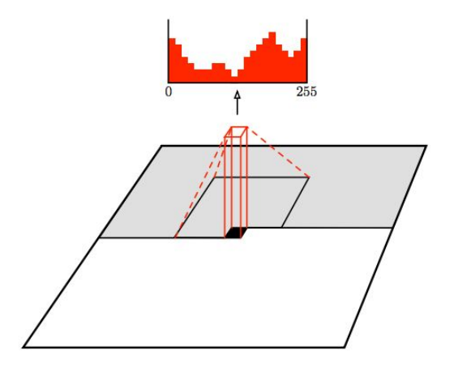

# PixelCNN

Como vimos, a utilização do método PixelRNN, pode, muitas vezes, ser mais lento que o desejável,
para isso, podemos adicionar camadas de convolução no nosso modelo. PixelCNN usa esse tipo
de camada com o objetivo de paralelizar as operações de geração de pixel, preservando a resolução
espacial da imagem gerada.

Da mesma forma que PixelRNN, PixelCNN gera a imagem a partir de um canto da imagem, porém,
agora, utilizando de uma ConvNet para paralelizar esse processo.

  

Figura 90: Geração de uma imagem através do método PixelCNN. Podemos perceber que os valores dos pixels são
gerados sequencialmente através de uma camada de convolução. Os pixels previamente gerados estão representados
em cinza e os valores de probabilidade são calculados paralelamente através da convolução.

Como a geração dos pixels continua sequencial, isso pode ser um ponto negativo que, muitas vezes,
pode tornar a geração da imagem, ainda muito lenta. Para isso, nas próximas seções iremos discutir
métodos mais eficientes para realizar esse procedimento.
