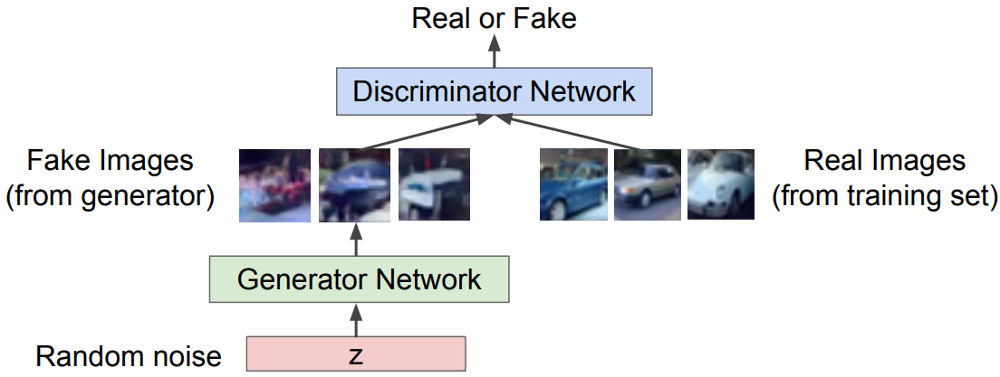

# Treinamento: Jogo de dois jogadores

A forma que iremos treinar e fazer com que o nosso modelo aprenda a geração de dados é através da
visualização desse problema como um jogo de dois jogadores. Existem dois jogadores: a rede neural
geradora e a rede neural discriminadora.

A rede neural geradora (ou _Generator network_) tenta enganar o discriminador gerando imagens de
aparência real. E a rede neural discriminadora (ou _Discriminator network_) tenta distinguir imagens
reais e falsas. A representação desse ”jogo” mostrada a seguir na Figura 96.

  

Figura 96: A partir de uma imagem inicializada aleatoriamente z, uma rede neural gerado, representada em verde,
gera imagens falsas, porém muito semelhantes às reais e uma rede neural discriminadora, representada em azul, tenta
distinguir se as imagens dadas como entrada para essa rede neural são falsas ou reais.

Utilizamos o algoritmo Minimax para realizar o treinamento de uma GAN, cuja função principal está
descrita a seguir.

\\[
  \large{} \underset{\theta _g}{min} \\ \underset{\theta _d}{max}
    \Big[ \mathbb{E} _{x \sim p _{data}} \log \\
    D _{\theta _d}(x) \\ +
    \mathbb{E} _{z \sim p _z} \log (1 - D _{\theta _d} (G _{\theta _g}(z))) \Big]
\\]

onde:

\\( D _{\theta _d}(x): \\) Saída do discriminador para dados reais \\( x \\)

\\( D _{\theta _d} (G _{\theta _g}(z))): \\) Saída do discrminador para dados falsos gerados
\\( G(z) \\)

Com essa equação, desejamos maximizar o objetivo do discriminador \\( \theta _d \\) , de forma que \\( D(x) \\)
é próximo de 1 (imagem real) e \\( D(G(z)) \\) é próximo de 0 (imagem falsa). E desejamos minimizar o
objetivo do gerador \\( \theta _g \\) de forma que \\( D(G(z)) \\) é próximo de 1 (discriminador é enganado a pensar
que \\( G(z) \\) é real).

Com isso, utilizamos métodos de maximizar e minimizar os discriminadores e geradores, respectiva-
mente. Usamos o método de gradiente ascendente para o discriminador

\\[
  \large{} \underset{\theta _d}{max} \\ \mathbb{E} _{z \sim p _z} \log (1 - D _{\theta _d} (G _{\theta _g}(z)))
\\]

Com isso, podemos descrever o seguinte algoritmo para o treinamento de GANs:

---

**Algorithm 13** Algoritmo de treino de uma GAN

---

1: **procedure**

2: &emsp; **for** número de iteração de treino **do**

3: &emsp;&emsp; **for** \\( i=1 \\) **to** \\( k \\) **do**

4: &emsp;&emsp;&emsp; Crie amostras _minibatch_ de \\( m \\) amostras inicializadas aleatoriamente
\\( \\{z ^{(1)}, \dots , z ^{(m)} \\} \\) a partir de \\( p _g (z) \\)

5: &emsp;&emsp;&emsp; Crie amostras _minibatch_ de \\( m \\) exemplos \\( \\{ x ^{(i)}, \dots , x ^{(m)} \\} \\)
a partir da geração de dados pela distribuição \\( p _{data}(x) \\)

6: &emsp;&emsp;&emsp; Atualize o discriminador pelo gradiente ascendente

7: &emsp;&emsp;&emsp; \\( \nabla _{\theta _d} \frac{1}{m} \sum _{i=1} ^m
  \Big[ \log D _{\theta _d}(x ^{(i)}) + \log (1 - D _{\theta _d}(G _{\theta _g}(z ^{(i)}))) \Big] \\)

8: &emsp;&emsp; **end for**

9: &emsp;&emsp;
Crie amostras _minibatch_ de \\( m \\) amostras inicializadas aleatoriamente \\( \\{z ^{(1)}, \dots , z ^{(m)} \\} \\)
a partir de \\( p _g (z) \\)

10: &emsp;&emsp; Atualize o gerador pelo gradiente ascendente

11: &emsp;&emsp; \\( \nabla _{\theta _g} \frac{1}{m} \sum _{i=1} ^{m}
  \log (D _{\theta _d} (G _{\theta _g}(z ^{(i)}))) \\)

12: &emsp; **end for**

13: **end procedure**

---

Após o treinamento, podemos usar a rede neural geradora para gerar novas imagens. Podemos
perceber na Figura 97 alguns exemplos de imagens geradas por uma GAN.

  

Figura 97: Imagens geradas a partir do treinamento de uma GAN. As imagens contornadas em amarelo são imagens
do conjunto de treino e, portanto as imagens da mesma linha são as vizinhas mais próximas.

