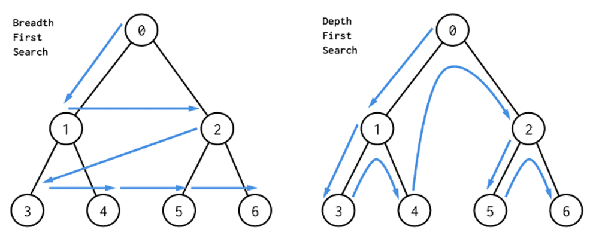

# Uninformed Search

É um algoritmo de busca genérica o qual percorre todos os nodos da árvore a fim de valorar os
estados intermediários.

Para realizar essa valoração, temos buscas em profundidade e em largura, como pode ser visto na
Figura 100 abaixo.

  

Figura 100: Representação das buscas em profundidade e largura. Percebe-se que todos os nodos da árvore são
acessados durante a busca.

Percebe-se que uma árvore com \\( b \\) ramos por nível e profundidade \\( d \\) teria \\( b ^d \\) número de nós folha.
Por exemplo, no jogo Go, cujo número de ramos por nível é 250, no nível 5 da árvore, teríamos
\\( 250 ^5 = 976.562.500.000 \\) possibilidades de estados.

O maior problema desse tipo de busca é que, quanto maior a complexidade do problema, maior a
profundidade e largura da árvore, o que torna o método extremamente ineficiente.
