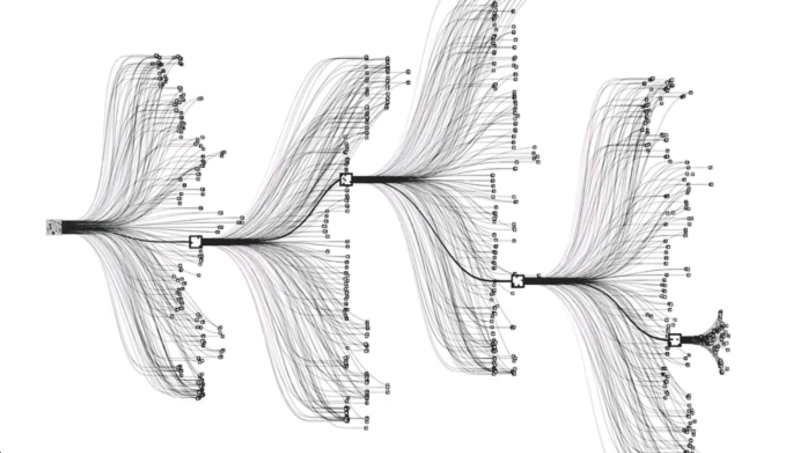

# Busca de Monte Carlo

O método de Busca em Árvore de Monte Carlo (do inglês, Monte Carlo Tree Search (MCTS)) é
extremamente poderoso para diversas aplicações que envolvem IA e teoria dos jogos. Uma das
principais aplicações desse método na literatura foi, em 2016, no artigo publicado pela DeepMind
[19](../../referencias), no qual atingem níveis humanos no jogo Go utilizando técnicas de DQN, vistas na Seção
[_Deep Q-Learning_](../5/6-5.md) e MCTS.

  

Figura 99: Representação de uma árvore de Monte Carlo gerada a partir de um estado de jogo do jogo Go. Cada
nodo da árvore representa uma possibilidade de jogada baseada no estado de jogo imediatamente anterior.

O principal objetivo de MCTS é valorar estados intermediários do ambiente de forma que não seja
necessário atingir estados finais para encontrar a melhor possibilidade de recompensa.

Para introduzir esse método, será definido, primeiramente um método _uninformed search_, que é mais
simples e ineficiente, para depois descrever o método MCTS.
