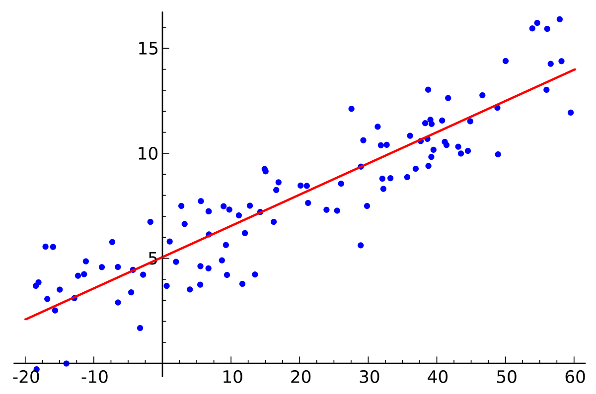

# Regressão linear

Regressão é um método que modela um valor de destino com base em preditores independentes.
Este método é usado, principalmente, para prever e descobrir a relação de causa e efeito entre as
variáveis.

Uma regressão linear simples é um tipo de regressão que analisa, a partir de um conjunto de variáveis
independentes de entrada \\( x \\), a relação entre essas variáveis com os seus respectivos valores esperados
\\( y \\). Na Figura 4, abaixo, a linha vermelha representa a melhor reta que aproxima melhor cada um
dos pontos representados em azul. Ou seja, baseado em um conjunto de dados, tentamos gerar uma
reta que modela cada um desses dados de forma ótima.

  

Figura 4: Representação de uma reta gerada a partir do método de regressão linear. A reta em vermelho representa a
melhor aproximação de cada um dos pontos representados em azul, que são os dados de entrada.

A reta gerada pela regressão linear pode ser modelada a partir da equação linear abaixo:

\\[
  \large{} y = \theta _0 + \theta _1 x
\\]

Portanto, o objetivo do algoritmo de regressão linear é encontrar os melhores valores de
\\( \theta _0 \\) e \\( \theta _1 \\).

Os métodos utilizados para calcularmos esses parâmetros serão apresentados nas seções seguintes.
