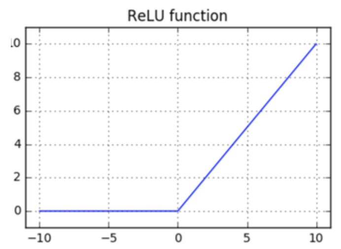

# Camada de ativação: _Rectified Linear layer_ (ReLU)

A _Rectified Linear Layer_ é uma função de ativação, assim como a função sigmoide que nos retorna
_Rectified Linear Units_ (ReLUs). É uma das funções de ativação mais utilizadas, atualmente, nas
implementações de redes neurais devido ao fato de ser mais simples e mais barata que a função
sigmoide.

Podemos implementar a ativação ReLU da seguinte forma:

---

\\[
  \large{} y = f _{relu}(x)=relu(x), \\ \\ onde \\ \\ y _i = max(0, x _i)
\\]

---

Para melhor compreensão, a Figura 20 representa o comportamento da função \\( relu(x) \\) de acordo
com os parâmetros \\( x \\) de entrada.

  

Figura 20: Representação da função ReLU usada para a camada de ativação

