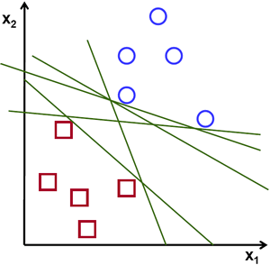

# _Support Vector Machines_ (SVMs)

_Support Vector Machines_, ou SVMs, podem ser usadas para tanto para problemas de regressão
quanto problemas de classificação. O objetivo principal de uma SVM é encontrar um hiperplano em
um espaço \\( N \\)-dimensional, sendo \\( N \\) o número de parâmetros, que classifica de forma distinta cada
um dos dados.

Na Figura 28 a seguir, podemos perceber a funcionalidade de uma SVM na busca de um hiperplano
ótimo (imagem à direita).

  

Figura 28: Exemplificação da utilização de uma SVM para encontrar o hiperplano ótimo que divide duas classes
distintas de dados. Na imagem à esquerda temos todos os hiperplanos possíveis que distinguem as duas classes de
dados e na imagem à direita temos o hiperplano ótimo que as distinguem.

Nosso objetivo é encontrar um plano que possui a margem máxima, ou seja, que possui a máxima
distância entre os pontos de ambas as classes.

Hiperplanos são limites de decisão que ajudam a classificar as classes de dados. Além disso, a
dimensão de um hiperplano depende do número de parâmetros.

Com isso, temos a definição de _support vectors_. _Support vectors_ são pontos que estão mais próximos 
ao hiperplano e influenciam a posição e a orientação desse hiperplano. Usando-os, podemos
maximizar a margem do classificador.
