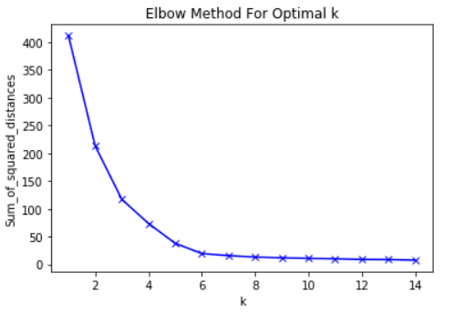

# Inicialização

Um método recomendado para o algoritmo \\( K-Means \\) é inicializar aleatoriamente os _cluster centroids_.
Para isso, devemos considerar os seguintes requisitos:

- \\( K \< m \\): O número de _clusters_ deve ser menor que o número de exemplos de treino;

- Aleatoriamente escolher \\( K \\) exemplos de treinos;

- Definir \\( \mu _1, \dots , \mu _K \\) serem iguais aos \\( K \\) exemplos.

Para escolher o número de _clusters_, usa-se um método chamado _elbow method_, o qual se analisa a
curva da função custo \\( J \\) e o número de _clusters_ \\( K \\), representado na Figura 30. A
função custo deve decrescer de acordo com o aumento do número de _clusters_ até tender a zero. Escolhemos
um valor para \\( K \\) no ponto em que a função custo começa a se estabilizar.

  

Figura 30: Representação do método de escolha do valor ótimo de \( K \) para o algoritmo KNN.

Uma outra forma de escolher o número de _clusters_ é de acordo com o objetivo que desejamos atingir
com o uso deles.
