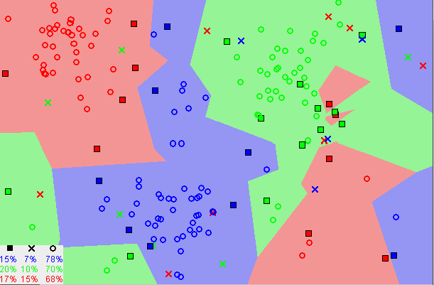

# _K-Nearest Neighbors_

_K-Nearest Neighbors_ (KNN) é um classificador que se baseia na similaridade dos dados próximos.
Em outras palavras, classifica os dados em grupos de acordo com a similaridade entre eles e o quão
próximo estão entre eles.

Na Figura 31 abaixo, podemos perceber como é realizada essa classificação. Cada uma das cores da
imagem representa um conjunto de dados que possui similaridade entre si.

  

Figura 31: Representação das similaridades entre os conjuntos

A ideia de similaridade menciona é baseada na distância entre os pontos no gráfico.
