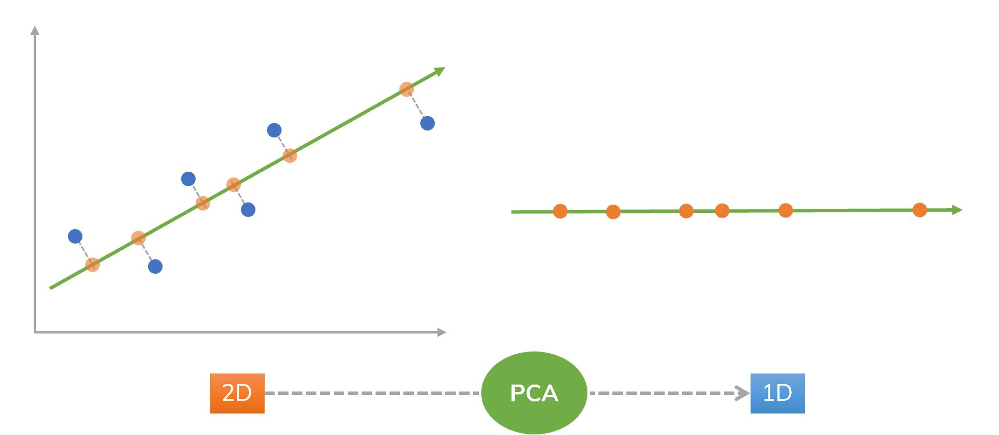

# Análise do componente principal (PCA)

O algoritmo de análise do componente principal (do inglês, _Principal Component Analysis Algorithm_
(PCA)) é um algoritmo de redução de dimensionalidade de dados. Como está representado na
Figura 32, o algoritmo busca comprimir os dados relacionando cada um dos dados em uma só
semelhança, em outras palavras, busca reduzir a média de todas as distâncias de cada um dos
valores em relação a linha projetada. Essa redução é chamada de erro de projeção.

  

Figura 33: Representação da aplicação do algoritmo de PCA. Percebe-se que o algoritmo busca encontrar uma
relação entre os pontos e fim de projetar os dados sobre essa relação. Na figura, os pontos em azuis são relacionados
e projetados sobre a reta em verde, gerando os pontos em laranja sobre a reta.

