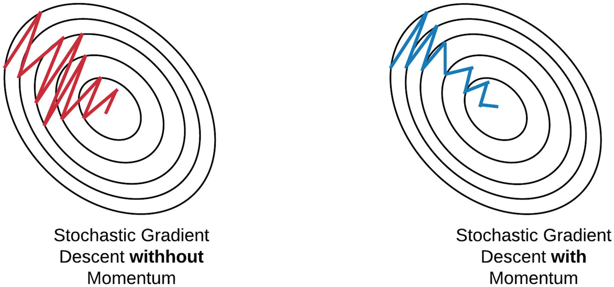

# SGD + _Momentum_

Como foi explicado, um dos problemas do SGD é que muitas vezes, o algoritmo pode ficar "preso"
em um mínimo local próximo do global e não convergir de forma adequada para o nosso problema.
Para isso, uma forma de otimização foi utilizar _momentum_ a fim de incentivar a convergência.

Antes de definir esse método de otimização, podemos intuitivamente compreender como funciona o
_momentum_. Para isso, podemos pensar em uma bola que rola em uma colina do ponto mais alto ao
mais baixo, seguindo a inclinação. Desejamos que essa bola tenha a noção de onde ela está indo.
Essa intuição pode ser relacionada aos valores dos parâmetros que desejamos atualizar, ou seja, esses
parâmetros se comportariam como se fossem a tal bola.

Uma boa definição para o _momentum_ é que é uma média móvel dos nossos movimentos, ou seja,
como determinado corpo se comporta em determinado terreno de acordo com a velocidade e a
aceleração proporcionada pelo mesmo. Dessa forma, a cada etapa do processo de otimização da
função custo, teremos vetores que representam o _momentum_ do ponto em determinada parte do
"terreno" da função custo, e esses vetores proporcionarão uma velocidade maior de convergência na
direção a qual ele está apontando.

Na Figura 40 está representada a diferenciação no comportamento do SGD sem e com a utilização
de _momentum_.

  

Figura 40: À esquerda representação no comportamento dos parâmetros sendo minimizados através do método SGD
e à direita o mesmo método com a aplicação de <i>momentum</i>.

Podemos diferenciar os dois modelos de otimização da forma que segue:

| SGD                                             | SGD + Momentum                                |
|-------------------------------------------------|-----------------------------------------------|
| \\( x _{t+1} = x _t - \alpha \nabla f(x _t) \\) | \\( v _{t+1} = \rho v _t + \nabla f(x _t) \\) |
|                                                 | \\( x _{t+1} = x _t - \alpha v _{t+1} \\)     |

Onde \\( x _i \\) representa os parâmetros a serem atualizados, \\( v _i \\) representa o momentum do ponto em determinada parte,
\\( \nabla f(x _i) \\) representa o gradiente da função custo e \\( \rho \\) representa o atrito do ponto
em determinada parte (geralmente esse parâmetro é definido como 0.9 ou 0.99).

Contudo, um dos problemas que esse método de otimização proporciona é que, muitas vezes, quando
os parâmetros se aproximam do mínimo, devido ao _momentum_, demoram para convergir pois ultrapassam
esse mínimo. Para resolver esse problema, devemos desacelerar a atualização desses
parâmetros de acordo que eles se aproximam do mínimo, o que será visto na seção seguinte.
