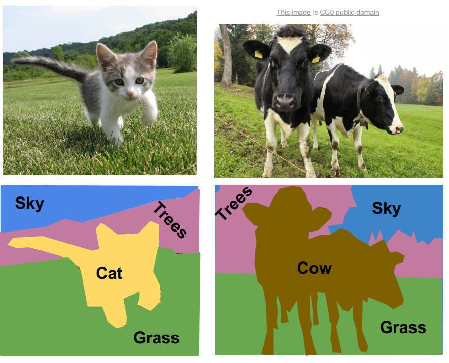
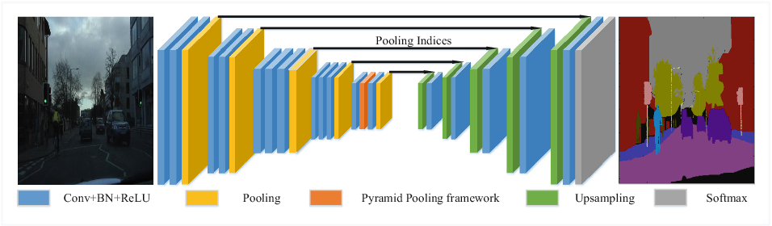

# Segmentação Semântica

Dada uma imagem, desejamos classificar cada pixel dessa imagem em diferentes categorias. Podemos
verificar na Figura 50 que dadas imagens de entradas, classificamos cada pixel em cinco diferentes
categorias: céu, árvores, grama, gato ou vaca.

  

Figura 50: Representação de segmentação semântica. Na coluna da esquerda, percebemos que classificamos a
imagem de um gato em quatro categorias representadas pelas cores azul, rosa, verde e amarelo. Na coluna da direita
classificamos a imagem em quatro categorias representadas pelas cores azul, rosa, verde e marrom.

Para a implementação desse método, utilizamos de ConvNets que trabalham de forma muito específica:
diminuindo e aumentando a resolução da imagem usando _pooling_ e _upsampling_ ou _unpooling_.

  

Figura 51: Representação de uma ConvNet de segmentação semântica. Percebemos que existem dois tipos de
alteração da resolução da imagem: usando <i>pooling</i>, que diminui a resolução da imagem e <i>upsampling</i> que aumenta a
resolução da imagem.

Com essa implementação, podemos promover o aprendizado da rede neural centrado em cada pixel
da imagem e, assim, classificar cada pixel em diferentes classes.
