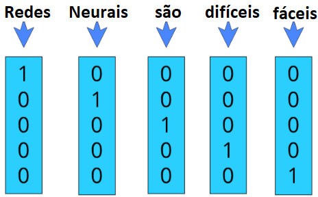

# _One-hot encoding_

_One-hot encoding_ representa cada palavra como um vetor de tamanho \\( V \\) , onde \\( V \\) é o número de
palavras únicas no nosso conjunto de dados. Cada palavra é codificada em um vetor binário no qual
o valor 1 é um índice único para cada palavra e o valor 0 para o restante das palavras. Para visualizar
isso melhor, podemos pensar nas duas frases: ”Redes Neurais são difíceis” e ”Redes Neurais são
fáceis”, como estão exemplificadas na Figura 61.

  

Figura 61: Exemplo da codificação <i>one-hot</i> em um vocabulário de cinco palavras, ou seja,
V = 5 → [’Redes’, ’Neurais’, ’são’, ’difíceis’, ’fáceis’] .

Essa codificação mapeia cada palavra a um vetor único em que cada posição representa uma palavra
distinta do vocabulário. Esse método converte qualquer palavra em valores numéricos de uma maneira
muito simples.

Todavia, com essa codificação temos dois problemas principais: uso de memória inutilizada e perda
semântica da frase. Primeiramente, teremos um vetor codificado para cada uma das palavras que
aumenta o tamanho de acordo com a complexidade do vocabulário, então teremos um vetor enorme,
composto basicamente por zeros, para representar uma só palavra o que pode levar a um uso excessivo
e desnecessário de memória. Além disso, esse tipo de codificação não guarda o significado semântico
de cada palavra. Para isso, gostaríamos de representar um vetor que representasse o valor semântico
de cada palavra e similaridade entre elas, por exemplo, as palavras ”fáceis” e ”difíceis”, gostaríamos
que fossem dois vetores completamente distintos, enquanto ”errado” e ”incorreto” gostaríamos que
fossem vetores semelhantes.

Para isso, utilizamos de outro método de codificação chamado _word2Vec_ que resolve os dois
problemas citados acima.
