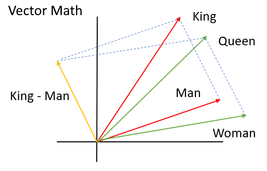

# Vetores de palavras (_word embeddings_)

Como foi mencionado, uma das principais utilizações de RNNs é para o processamento de linguagem
natural. Contudo, uma rede neural não consegue distinguir diferenças semânticas entre frases e
impactos de determinadas palavras apenas pelo contexto. Sabemos que uma rede neural trabalha
com valores numéricos e, para isso, devemos codificar essas palavras e frases de forma que o nosso
modelo possa reconhecer e processar essas diferenças entre elas.

  

Figura 59: Representação de um espaço vetorial formado pelas <i>word embeddings</i>. Podemos verificar as similaridades
das palavras dentro de um mesmo círculo e a diferenças entre elas quando não pertencem ao mesmo grupo.

Dessa forma, palavras podem ser diferenciadas em um espaço vetorial de acordo com o ângulo que
geram entre elas. Por exemplo, palavras com significados opostos tendem a gerar um ângulo maior,
enquanto palavras com significados similares geram um ângulo menor. Podemos verificar isso, na
Figura 60, a seguir.

  

Figura 60: Representação da diferenciação de palavras através de vetores. Percebe-se que palavras com significado
similar, possuem um ângulo menor, como por exemplo, as palavras ’King’ e ’Queen’, enquanto palavras com
significados distintos como ’Woman’ e ’King’ possuem um ângulo maior.

Nesta seção, serão apresentadas formas de pré-processamento de dados em forma de texto a fim de
alimentar a nossa rede neural. Para convertermos esse texto para valores numéricos, utilizaremos um
métodos chamados _one-hot encoding_ e _word vectors_.
