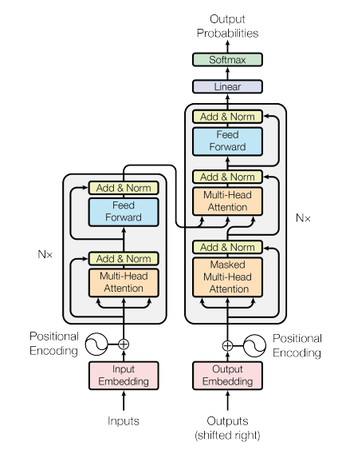

# _Transformers_

O artigo publicado em 2017 chamado "Attention is all you need"[[21]](../../referencias.md) mudou a forma de como o
mecanismo de attention era visto. _Transformers_ começaram a ser aplicados em tarefas de NLP e
agora estão sendo utilizados em diversas outras áreas de pesquisa como CV.

Como visto nas seções anteriores, arquiteturas de RNNs, como por exemplo LSTMs, processam os
dados sequencialmente através das suas diversas _hidden layers_, empilhando as informações. No caso
dos _transformers_, as informações são processadas paralelamente, o que acarreta na perda de ordem
das sequências.

Um transformer possui uma arquitetura similar aos modelos previamente vistos. Ele consiste num
conjunto de encoders e decoders, como podemos visualizar na Figura 80, a seguir.

  

Figura 80: Representação de uma estrutura básica de um <i>transformer</i>. Percebe-se que a partir de uma dada entrada,
as sequências

A revolução dos _transformers_ começou com a ideia de mudar a representação da entrada dos dados a
fim de alimentar toda a camada de _input_ de uma vez só através de um conjunto em forma de _tokens_,
exemplificado na Figura 81. Esse conjunto de entrada pode ser escrito como \\( X = x _1 , x _2 , \dots , x _N \\),
onde \\( x \in \mathbb{R} ^{N \times d _{in}} \\) onde os elementos da sequência \\( x _i \\) referem-se aos *tokens*.

  

Figura 81: Exemplificação do processo de tokenização. Percebe-se que dado um conjunto fixo de uma sequência de
palavras, dividimos cada uma dessas palavras em <i>tokens</i> a fim de serem processamos como um conjunto.

Após a tokenização, projetamos essas palavras em espaço geométrico distribuído, ou seja, como visto
na Seção [Vetores de palavras](../2/6-2-2.md), _word embeddings_, capturando o sentido semântico das palavras.
