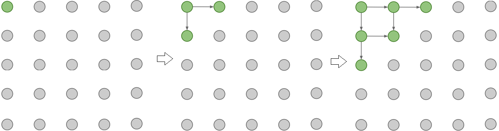

# PixelRNN

Através da utilização de modelos probabilísticos de densidade, como por exemplo Distribuição Normal,
consegue gerar imagens começando através de um canto e calculando qual é o valor do próximo pixel
que mais faz sentido de acordo com os pixels previamente gerados e com um valor de probabilidade.

Para processar a relação entre geração do pixel e valor de probabilidade, utilizamos de modelos que
funcionam bem com sequências, como por exemplo, Redes Neurais recorrentes (RNNs).

  

Figura 89: Geração de pixels utilizando PixelRNN. A partir de um pixel do canto da imagem, o modelo começa a
gerar, sequencialmente outros pixels baseados nos valores de probabilidade e nos valores dos pixels previamente
gerados.

A rede neural "varre" a imagem gerando, linha a linha e pixel a pixel a cada período de tempo, o que
pode ser, muitas vezes, muito demorado. Os valores dos pixels são gerados baseando-se nos valores
de probabilidade gerados através de uma distribuição que é escrita a partir do produto condicional
das distribuições e os valores gerados são compartilhados através da imagem.

O objetivo, então é calcular a probabilidade \\( p(x) \\) para cada pixel da imagem de tamanho \\( nxn \\).
Assim, a probabilidade pode ser escrita da seguinte forma:

\\[
  \large{} p(x) = \prod _{i=1} ^{n ^2} p(x _i|x _1, \dots , x _{i-1})
\\]

A equação acima é a probabilidade do \\( i \\)-ésimo pixel dada a probabilidade de todos os pixels pre-
viamente gerados. Essa geração se dá linha a linha e pixel por pixel. Além disso, cada pixel \\( x _i \\) é
juntamente determinado por todos os três canais de cores RGB. Assim, a probabilidade condicional
do \\( i \\)-ésimo pixel se torna:  

\\[
  \large{} p(x _{i,R}|X _{<i}) p (x _{i,G}|X _{<i}, x _{i,R})
    p (x _{i,B}|X _{<i}, x _{i,R}, x _{i,G})
\\]

Portanto, cada cor é condicionada sobre as outras cores e os pixels previamente gerados.

Contudo, um dos principais problemas desse tipo de implementação é a velocidade. Como geramos
cada pixel sequencialmente, isso pode ser extremamente lento de acordo com a complexidade da
saída. Para resolver esse problema de otimização, podemos utilizar um método similar e paralelizável
utilizando ConvNets, chamado PixelCNN.
