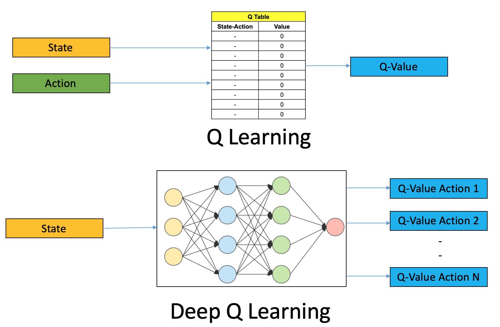

# _Deep Q-Learning_

Como foi visto na Seção [Aprendizado por reforço (_Reinforcement learning_)](../../parte-4/4/4-4.md),
através do método de _Q-learning_, atualizamos os valores das políticas do
agente maximizando os valores de Q de acordo com o estado futuro do ambiente e da ação tomada,
de maneira recursiva, usando a equação de Bellman.

Contudo, apesar do grande poder desse método, de acordo com a complexidade do ambiente, ele
pode ser tornar extremamente ineficiente. Para resolver esse problema, usamos um método que
engloba _Q-learning_ e redes neurais profundas, chamado _Deep Q-learning_ (DQN).

De maneira geral, ao invés de trabalharmos com uma tabela para atualizar os valores de Q de decisão
de ação do agente, utilizamos uma rede neural. Essa rede neural funciona através de uma função
de aproximação, chamada de aproximador, denotado por  \\( Q(s, a; \theta) \\), em que \\( \theta \\)
representa os pesos treináveis da rede, para aproximar os valores de Q de forma ótima.

Assim, a equação de Bellman, vista na Seção [_Q-Learning_](../../parte-4/4/4-4-6.md) é utilizada como
a função custo, que deve ser minimizada. Em outras palavras, minimizamos a diferença entre a igualdade
do valor Q que deve ser atualizado em relação a soma da recompensa com o desconto do máximo valor de Q
dos estados futuros. Ou seja,

---

\\[
  \large{} Cost = \Big[ Q(s,;\theta) -
    \Big( r(s,a) + \gamma \\ \underset{a}{max} \\ Q(s',a;\theta) \Big) \Big] ^2
\\]

---

onde \\( Q(s,;\theta) \\) é chamado de _Q-target_, os parâmetros da rede neural.

O treinamento desse tipo de rede neural acontece durante o momento de _exploration_ e _exploitation_,
atualizando os valores de Q já vistos e que serão descobertos futuramente. Para o treino, portanto,
selecionamos \\( b \\) estados já visitados, juntamente com os seus respectivos valores, de maneira aleatória,
e usamos esses valores como _input_ e _target_, respectivamente.

Diferentemente do método de _Q-learning_ tradicional, DQN prevê os \\( N \\) possíveis valores de Q para um
determinado estado. Na Figura 98 abaixo, está representada essa diferença entre os dois métodos.

  

Figura 98: Representação dos dois métodos de <i>Q-learning</i>. Na figura do topo, a partir de uma determinada ação
tomada em um estado de ambiente, gera-se um valor de Q referente a este par estado-ação. Na figura de baixo, dado
um estado, a rede neural calcula todos os valores de Q referentes a todas as ações possíveis a serem tomadas,
selecionando o melhor valor para aquele estado.

Com isso, podemos listar as etapas que envolvem o aprendizado de uma rede neural.

1. Passar como entrada estado atual \\( s \\) do ambiente para a rede neural. Essa rede neural irá
retornar os valores Q de todas as possíveis ações a serem tomadas pelo agente no estado \\( s \\).

2. Selecionar uma ação usando a política \\( \epsilon \\)_-greedy_. Com a probabilidade \\( \epsilon \\),
selecionar uma ação aleatória \\( a \\) (_exploration_) e com a probabilidade \\( 1 - \epsilon \\)
escolher a ação que corresponde o valor máximo de Q, tal que \\( a = argmax(Q(s,a;\theta)) \\)

3. Realizar a ação tomada \\( a \\) no estado \\( s \\) e mover para o próximo estado \\( s' \\)
para receber a recompensa.

4. Após, tomamos uma decisão aleatória de transição de estado e calculamos o custo

5. Minimizar o erro da função custo utilizando algum método de otimização, como por exemplo,
gradiente descendente

6. A cada \\( C \\) iterações, copiar os pesos da rede neural atual para uma rede neural _target_ a fim de
salvar os pesos

7. Repetir esses passos \\( M \\) episódios

Com DQN, temos uma ferramenta extremamente forte para resolução de problemas de aprendizado
de RL. Agora, com ambientes mais complexos e com mais interações, o agente consegue realizar uma
melhor valoração das possibilidades de ações que podem ser tomadas baseadas no retorno da rede
neural. Atualmente, jogos de Atari, Go e StarCraft já atingiram níveis humanos de comportamento
utilizando DQN e outros métodos de IA.
