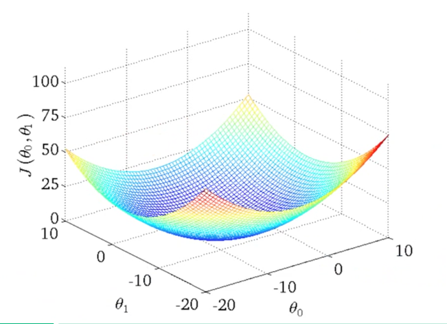
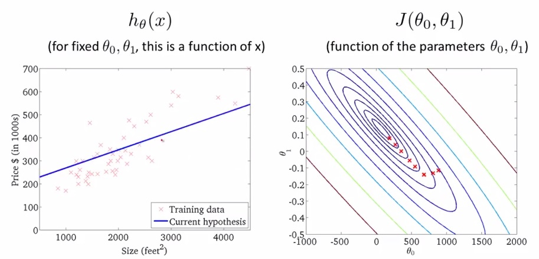

# Função Custo (_Cost Function_)

A função custo - também chamada de _loss function_ - pode ser utilizada para medir a precisão da
nossa função hipótese \\( h:X \rightarrow Y \\). A função custo utiliza da diferença média de todos os resultados
da função hipótese com todos *inputs* de \\( x \\) e *outputs* de \\( y \\), como representado na Figura 5.

\\[
  \large{} J(\theta _0 , \theta _1) = \frac{1}{2m} \sum _{i=1} ^m (ŷ _i - y _i) ^2 =
    \frac{1}{2m} \sum _{i=1} ^m (h _{\theta}(x _i) - y _i) ^2
\\]

Através dessa expressão podemos perceber que o objetivo principal da função custo é minimizar a
diferença entre o resultado esperado a função hipótese e o valor de \\( y \\) através das entradas
\\( \theta _0 \\) e \\( \theta _1 \\). Essa função também é conhecida como *Squared error function* ou *Mean squared error*.

  

Figura 5: Representação da função custo

Dessa forma, temos quatro predefinições básicas:

- Hipótese: \\( h _{\theta}(x) = \theta _0 + \theta _1 x \\);

- Parâmetros: \\( \theta _0 , \theta _1 \\);

- Função Custo: \\( J(\theta _0 , \theta _1) = \frac{1}{2m} \sum _{i=1} ^m (h _{\theta}(x _i) - y _i) ^2 \\);

- Objetivo: \\( \underset{\theta _0 , \theta _1} {min} \\ J(\theta _0 , \theta _1) \\)

Podemos utilizar linhas de contorno para representar a função de duas variáveis \\( J(\theta _0 , \theta _1) \\)
em apenas duas dimensões como representado nas Figuras 6 e 7.

  

Figura 6: Representação da função custo através de visualização 3D

  

Figura 7: Representação da função custo através de linha de contorno

Os gráficos da Figura 7 minimizam a função custo ao máximo. O resultado de \\( \theta _0 \\) e \\( \theta _1 \\)
tende a ficar em torno de 250 e 0.12, respectivamente. Em outras palavras, a melhor aproximação da função custo
está mais no centro das linhas de contorno. Chamamos o método de minimização da função
custo de método do gradiente descendente que será discutido na Seção
[Gradiente Descendente (_Gradient Descent_)](../4/2-4.md).
