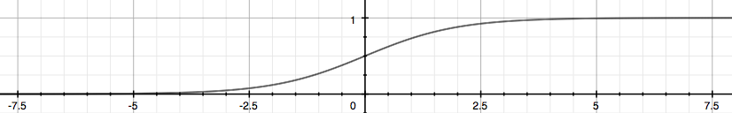

# Representação da hipótese

Podemos utilizar o nosso antigo algoritmo de regressão linear para prever um valor de \\( y \\) discreto
dado um valor de \\( x \\). Mas como foi mencionado anteriormente, essa não é uma boa solução para
problemas de classificação e para isso, devemos modificar a função hipótese a fim de satisfazer a
saída discreta dos problemas de classificação, ou seja, \\( 0 \geq h _{\theta}(x) \geq 1 \\).

Uma boa modificação seria basear a nossa função hipótese na função logística (_Logistic Function_)
de forma que possamos nos basear na função sigmoide conforme representada na Figura 10. Em
outras palavras, teremos:

---

\\[
  \large{} h _{\theta}(x) = g(\theta ^T x), \\ z = \theta ^T x, \\ g(z) = \frac{1}{1 + e ^{-z}}
\\]

---

  

Figura 10: Representação da função sigmoide

A função sigmoide mapeia um valor real em um valor no intervalo \\( (0,1) \\) fazendo com que seja a
melhor forma de implementação de problemas de classificação.

Dessa forma, podemos chegar a algumas conclusões e interpretações dessa nova forma de implementação
da função hipótese:

- \\( h _{\theta}(x) \\) nos dá a probabilidade da nossa saída ser 1.

- \\( h _{\theta}(x)=P(y=1|x; \theta )=1-P(y=0|x; \theta )P(y=0|x; \theta )+P(y=1|x; \theta )=1 \\)
