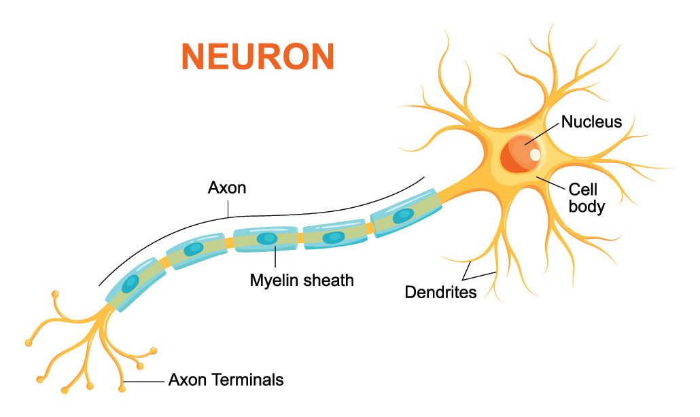

# Os Neurônios e o Cérebro

Problemas utilizando redes neurais são relativamente antigos, tendo sua origem entre os anos 80
e 90. O objetivo era, basicamente, modelar o cérebro humano através de algoritmos. Por exemplo,
uma função hipótese seria modelar o córtex auditivo a fim de reconhecimento de áudio, ou a área
de associação visual responsável pela visão.

Biologicamente, o cérebro humano é composto por estruturas nervosas chamadas de neurônios.
Neurônios são células responsáveis pela transmissão dos impulsos nervosos e constituem cerca de
10% do tecido nervoso. Eles são constituídos basicamente por três estruturas: corpo celular, dendritos
e axônio, como está representado na Figura 14.

  

Figura 14: Representação estrutural de um neurônio humano.

Baseando-se nessa estrutura, as redes neurais tem como objetivo modelar computacionalmente as
funções especificadas dos neurônios, como por exemplo, entendimento e geração de texto, análise e
classificação de imagens, entre outros.

Na seção seguinte serão apresentadas as modelagens principais das redes neurais artificiais.
