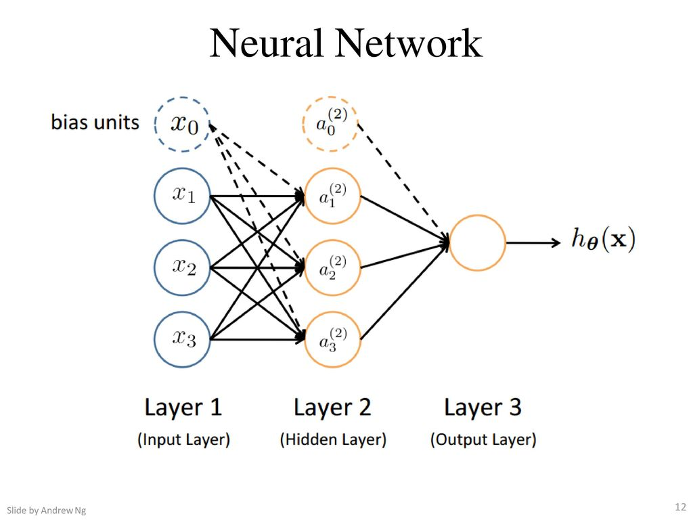

# Representação do modelo

A partir de uma análise biológica do cérebro humano, sabemos que dois neurônios se comunicam
através de impulsos nervosos chamados de sinapses. A informação recebida por um neurônio passa,
primeiramente, pelos dendritos e vai em direção ao axônio. Podemos modelar essas informações a
fim de gerar um modelo matemático que represente um neurônio da seguinte forma:

- Dendrito: entrada da função \\( (x _1, \dots , x _n) \\);

- Axônio: função hipótese \\( (h _{\theta}(x)) \\);

Nas redes neurais, utilizamos a mesma função utilizada na regressão logística \\( \large{} \frac{1}{1+e ^{-z}} \\),
a qual chamamos de "ativação" da função e os parâmetros \\( \Theta \\) são chamados de "pesos". Podemos perceber
na Figura 15 que o neurônio possui três camadas, as quais chamamos de camada de entrada (_input layer_),
camada escondida (_hidden layer_) e camada de saída (_output layer_). A camada de saída também pode ser
chamada de função hipótese \\( h _{\Theta} \\).

Com isso, devemos adicionar algumas notações relacionadas às redes neurais.

- Chamamos de \\( x _0, x _1, \dots , x _n \\) os valores da *input layer*, onde \\( x _0 = 1 \\) (*bias unit*);

- \\( a _i ^{(j)} \\) é unidade de "ativação" \\( i \\) na camada \\( j \\);

- \\( \Theta ^{(j)} \\) é a matriz de pesos que controla o mapeamento da função da camada \\( j \\)
para a camada \\( j+1 \\).

  

Figura 15: Representação de uma rede neural

Na Figura 15 podemos perceber que para gerar a saída (função hipótese) passamos por uma _input layer_ e
uma _hidden layer_. Com isso, podemos descrever uma equação para que possamos determinar
o valor da saída partindo dos parâmetros acimas identificados.

\\[
  \large{} a _1 ^{(2)} = g( \Theta _{10} ^{(1)} x _0 + \Theta _{11} ^{(1)} x _1 +
    \Theta _{12} ^{(1)} x _2 + \Theta _{13} ^{(1)} x _3)
\\]

\\[
  \large{} a _2 ^{(2)} = g( \Theta _{20} ^{(1)} x _0 + \Theta _{21} ^{(1)} x _1 +
    \Theta _{22} ^{(1)} x _2 + \Theta _{23} ^{(1)} x _3)
\\]

\\[
  \large{} a _3 ^{(2)} = g( \Theta _{30} ^{(1)} x _0 + \Theta _{31} ^{(1)} x _1 +
    \Theta _{32} ^{(1)} x _2 + \Theta _{33} ^{(1)} x _3)
\\]

\\[
  \large{} h _{\Theta}(x) = a _1 ^{(3)} = g( \Theta _{10} ^{(2)} a _0 ^{(2)} + \Theta _{11} ^{(2)} a _1 ^{(2)} +
    \Theta _{12} ^{(2)} a _2 ^{(2)} + \Theta _{13} ^{(2)} a _3 ^{(2)})
\\]

Percebe-se que a matriz \\( \Theta \\) é uma matriz de tamanho \\( 3 \times 4 \\) (3 = número de parâmetros na camada
dois e 4 = número de parâmetros de entrada). Quando aplicamos a função sigmoide para cada uma
das camadas, nós obtemos o nodo de ativação da próxima camada. Assim, a função hipótese é a
função logística aplicada na soma dos valores dos nodos de ativação os quais são multiplicados pelo
parâmetro da matriz \\( \Theta ^{(2)} \\) que contém os valores dos pesos da segunda camada de nodos.

Com isso, temos a seguinte definição:

<b>Se uma rede neural tem</b> \( s _j \) <b>unidades na camada</b> \( j \) <b>e</b> \( s _{j+1} \) <b>unidades na camada</b>
\( j+1 \)<b>, então</b> \( \Theta ^{(j)} \) <b>terá dimensões</b> \( s _{j+1} \times (s _j + 1) \)<b>.</b>

Com as definições vistas acima, podemos introduzir uma implementação vetorizada das funções vistas. Para isso, iremos definir
uma variável \\( z _k ^{(j)} \\) que engloba os parâmetros dentro da função \\( g \\). Assim, teríamos:

\\[
  \large{} a _1 ^{(2)} = g(z _1 ^{(2)})
\\]

\\[
  \large{} a _2 ^{(2)} = g(z _2 ^{(2)})
\\]

\\[
  \large{} a _3 ^{(2)} = g(z _3 ^{(2)})
\\]

Em outras palavras, para a camada \\( j=2 \\), a função \\( z \\) seria:

\\[
  \large{} z _k ^{(2)} = \Theta _{k,0} ^{(1)} x _0 + \Theta _{k,1} ^{(1)} x _1 +
    \Theta _{k,2} ^{(1)} x _2 + \dots + \Theta _{k,n} ^{(1)} x _n
\\]

E a função vetorizada teria a forma:

\\[
  \large{} x =
    \begin{bmatrix}
      x _0 \\\\ x _2 \\\\ \dots \\\\ x _n
    \end{bmatrix}
      , z ^{(j)} =
    \begin{bmatrix}
      z _1 ^{(j)} \\\\ z _2 ^{(j)} \\\\ \dots \\\\ z _n ^{(j)}
    \end{bmatrix}
\\]

Com \\( x = a ^{(1)} \\) teremos:

\\[
  \large{} z ^{(j-1)} = \Theta ^{(j-1)} a ^{(j-1)}
\\]

Com essas manipulações temos que a função hipótese pode ser definida da seguinte forma:

---

\\[
  \large{} h _{\Theta}(x) = a ^{(j+1)} = g(z ^{(j+1)})
\\]

---
