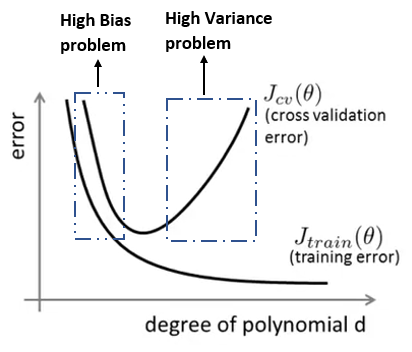

# Curvas de aprendizado

Nesta seção iremos interpretar gráficos que representam curvas de aprendizado analisando os valores
de \\( J _{train}(\theta), J _{cv}(\theta) \\) e \\( J _{test}(\theta) \\) para concluir se o treino
está bem ajustado, com _overfitting_ ou _underfitting_.

Em primeira análise, sabemos que para uma quantidade pequena de dados de entrada o valor do erro
esperado é próximo de zero, pois o modelo aprende cerca de 100% do conjunto de treino. Porém,
quando aumentamos o tamanho do conjunto de treino este erro tende a aumentar, muitas vezes,
tanto para o conjunto de treino, quanto para o conjunto de teste. Para isso, podemos analisar dois
tipos de situações esperadas: _high bias_ e _high variance_.

Na representação a seguir que representa o erro da função \\( J \\) para casos de treino e teste de acordo
com o grau do polinômio \\( d \\). Percebe-se que quanto maior o grau do polinômio, menor é a taxa de
erro no conjunto de treino e maior é a taxa de erro no conjunto de teste, e quanto menor o grau do
polinômio maior é a taxa de erro do conjunto de treino e maior é a taxa de erro do conjunto de teste.
Assim, devemos ajustar o grau do polinômio de forma que ele seja grande suficiente para evitar os
casos de _underfitting_ e _overfitting_.

  

Figura 25: Representação das curvas \( J _{cv}(\theta) \) e \( J _{train}(\theta) \) relacionando o grau
do polinômio \( d \) com a taxa de erro de cada uma dessas funções.

