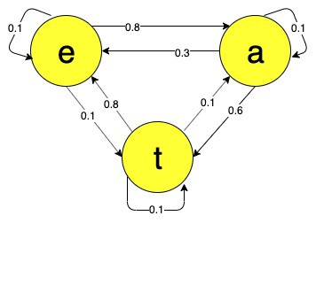

# Cadeia de Markov

A Cadeia de Markov é um modelo estocástico que descreve uma sequência de possíveis eventos os
quais são dependentes de uma possibilidade de ocorrência. E essa possibilidade só depende do evento
prévio a esta ação.

Quando usamos a Propriedade de Markov em um processo aleatório, chamamos esse uso de Cadeia
de Markov, podendo ser definida da seguinte forma:

A Cadeia de Markov é uma tupla \\( (S,P) \\) onde:

- \\( S \\) é um conjunto de estados;

- \\( P(s,s') \\) é uma transição de estado cujo peso é a probabilidade. A probabilidade de transição
do estado \\( s \\) no tempo \\( t \\) para o estado \\( s' \\) no tempo \\( t+1 \\).

  

Figura 35: Representação de uma Cadeia de Markov com os estados \(e, a, t\) onde cada aresta representa uma
transação de estado e seus pesos representam a probabilidade de transição.

