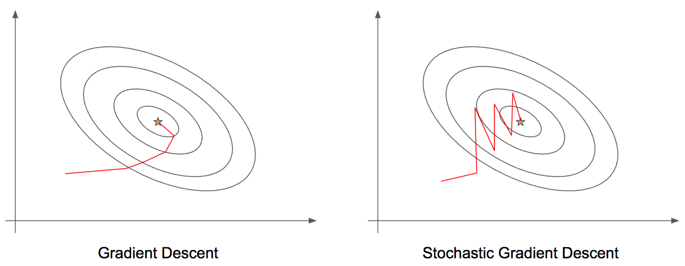
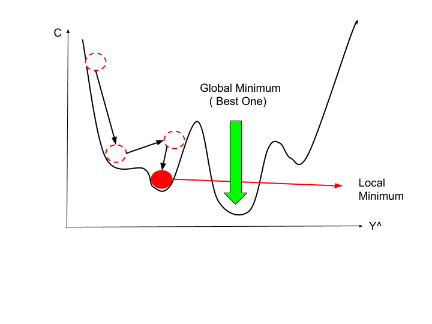

# _Stochastic Gradient Descent_ (SGD)

SGD é uma alternativa mais eficiente e escalável ao método clássico de otimização gradiente des-
cendente.

SGD pode ser escrito de maneira muito similar ao método de gradiente descendente clássico, visto.

\\[
  \large{} cost(\theta , (x ^{(i)}, y ^{(i)})) = \frac{1}{2}(h _{\theta}(x ^{(i)}) - y ^{(i)}) ^2
\\]

A principal diferença entre o método clássico e o SGD é que o SGD considera cada exemplo de treino
individualmente para calcular o custo antes de realizar a média dos custos, enquanto o método clássico
calcula o custo de acordo com a média dos valores.

Com isso, podemos definir a função custo da seguinte forma:

\\[
  \large{} J _{train}(\theta) = \frac{1}{m} \sum  _{i=1} ^m cost(\theta , (x ^{(i)}, y ^{(i)}))
\\]

\\( J _{train} \\), agora, é apenas a média dos custos aplicado a todos os exemplos de treino.

Com esse tipo de metodologia, podemos otimizar o cálculo das derivadas parciais a fim de reduzir a
função custo. Devido ao fato desse método ser estocástico, adicionamos aleatoriedade nas escolhas
dos custos dos exemplos de treino. Para cada uma dessas escolhas, otimizamos os valores dos custos
o que reduz de forma muito mais eficiente a complexidade da computação. Portanto, com o SGD,
computamos a atualização do parâmetro \\( \theta \\) para cada um dos exemplos de treino \\( x _i \\) em relação ao
seu rótulo \\( y _i \\), como podemos verificar abaixo:

\\[
  \large{} \theta = \theta - \alpha \cdot \nabla _{\theta} J(\theta ; x ^{(i)}; y ^{(i)})
\\]

onde \\( \alpha \\) é a taxa de aprendizado e \\( \nabla \\) é o gradiente do custo \\( J \\).

Podemos visualizar na Figura 37 as diferenças entre as etapas de aprendizado entre o método clássico
do gradiente descendente e o método estocástico. Percebemos, que SGD é mais "barulhento" em
relação ao método clássico, porém, como não precisamos calcular as derivadas para cada um dos \\( m \\) m
exemplos de treino por iteração, o SGD acaba sendo mais eficiente.

  

Figura 37

O algoritmo de SGD é muito similar ao algoritmo clássico, iremos atualizar os parâmetros \\( \Theta _j \\) ao
longo do aprendizado de acordo com a função custo, como segue:

---

**Algorithm 10** Algoritmo Stochastic Gradient Descent (SGD)

---

1: **procedure**

2: &emsp; Aleatoriamente,"misturar" o conjunto de dados

3: &emsp; **for** \\( i = 1 \\) **to** \\( m \\) **do**

4: &emsp;&emsp;
\\( \theta _j := \theta _j - \alpha (h _{\theta}(x ^{(i)}) - y ^{(i)}) \cdot x _j ^{(i)} \\)

5: &emsp; **end for**

6: **end procedure**

---

Esse algoritmo, diferentemente do método clássico, ajustará um exemplo de treino por vez. Com
isso, podemos prosseguir com o algoritmo de gradiente descendente, sem, necessariamente examinar
todos os \\( m \\) exemplos de treino antes.

Um dos problemas desse algoritmo é que, muitas vezes, ele não convergirá para o mínimo global do
problema e, ao invés disso, irá vagar aleatoriamente ao redor desse mínimo, porém, na maioria das
vezes, produz um retorno muito próximo ao esperado. Normalmente, o SGD varre o conjunto de
dados entre uma ou dez vezes antes de chegar próximo ao mínimo global. Como podemos perceber
na Figura 38, o SGD pode acabar travado em um mínimo local e isso resulta em dificuldade em
otimizar ao máximo a função custo, pois o algoritmo não irá convergir para o mínimo global.

  

Figura 38: Representação da dificuldade de convergência do algoritmo SGD. Percebe-se que a minimização da função
custo atinge um mínimo local devido às "voltas" que o algoritmo dá ao redor do mínimo global.

Podemos evitar esse tipo de problema incentivando a convergência do algoritmo. Para isso, podemos
escolher valores de α diferentes a cada iteração, diminuindo o seu valor.

Com uma taxa de aprendizado menor, o algoritmo irá oscilar de maneira mais suave, sem grandes
pulos em torno do mínimo global. Dessa forma, uma estratégia seria diminuir o valor de \\( \alpha \\) a cada
iteração, como segue:

\\[
  \large{} \alpha = \frac{const1}{iterationNumber+const2}
\\]

Todavia, esse método não é muito utilizado devido a quantidade extra de parâmetros que devem ser
ajustados.
