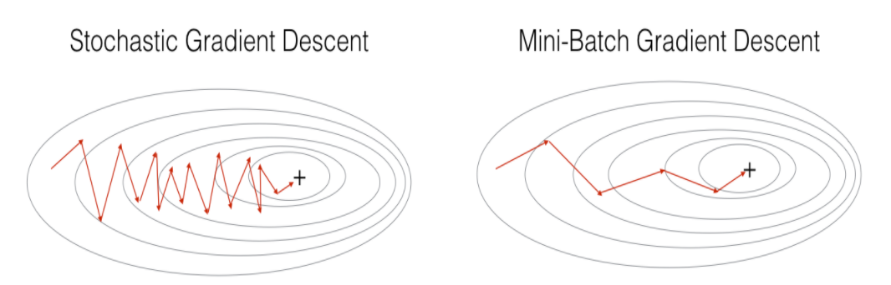

# _Mini-batch Gradient Descent_

_Mini-batch Gradient Descent_ muitas vezes, pode ser mais eficiente que o SGD. Ao invés de usarmos
todos os \\( m \\) exemplos de treino, como no método clássico, ou apenas um exemplo no SGD, usaremos
algo entre essas duas opções. Selecionaremos \\( b \\) exemplos de treino. O valor de \\( b \\), geralmente está
entre 2-100.

Na figura a seguir, podemos verificar as diferenças entre o SGD e o _Mini-batch Gradient Descent_.
Na imagem, percebe-se que o método _Mini-batch_ converge mais rapidamente, principalmente devido
ao fato de processar os dados em batches de forma vetorizada.

  

Figura 39

Por exemplo, se \\( b = 10 \\) e \\( m = 1000 \\), teremos o seguinte algoritmo:

---

**Algorithm 11** Algoritmo Mini-batch Gradient Descent

---

1: **procedure**

2: &emsp; Aleatoriamente,"misturar" o conjunto de dados

3: &emsp; **for** \\( i = 1,11,21,31, \dots , 991 \\) **do**

4: &emsp;&emsp;
\\( \theta _j := \theta _j - \alpha \frac{1}{10} \sum _{k=i} ^{i+9} (h _{\theta}(x ^{(k)}) - y ^{(k)}) \cdot x _j ^{(k)} \\)

5: &emsp; **end for**

6: **end procedure**

---

Nesse algoritmo, estamos simplesmente somando dez exemplos por vez. A principal vantagem em
computar mais de um exemplo por vez (em _batches_) é que podemos usar implementações vetorizadas
sobre os exemplos em \\( b \\).
