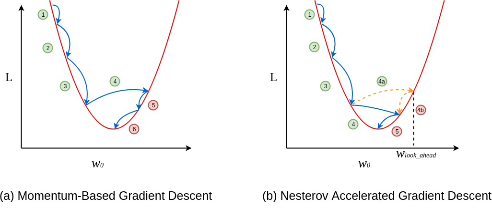
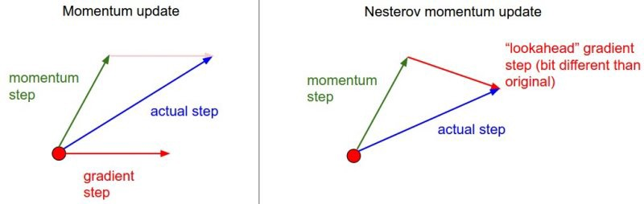

# Nesterov _Accelerated Gradient_ (NAG)

O método NAG utiliza da mesma ideia vista na seção anterior, porém, como foi dito, desaceleramos
a atualização dos parâmetros de forma a não ultrapassar de maneira muito significativa o valor de
mínimo da função.

Na Figura 41, abaixo está representada a diferença no comportamento da atualização dos valores
dos parâmetros.

  

Figura 41: Exemplificação do método de Nesterov (à direita) para gradiente descendente utilizando <i>momentum</i>
(à esquerda). Percebe-se que a cada passo, os valores da função custo diminuem tendendo ao mínimo. E quando esse
valor se aproxima do mínimo, desacelera para facilitar a convergência.

Nesse método de otimização da função custo, primeiro olhamos para o onde o vetor atual _momentum_
está apontando para, com ele, calcularmos o gradiente partindo desse ponto, como podemos verificar
na Figura 42.

  

Figura 42: Representação da atualização dos vetores <i>momentum</i> utilizando o método de Nesterov. Na imagem à
esquerda, verificamos a atualização do vetor <i>momentum</i> a partir de um determinado ponto. Na figura à direita
verificamos a atualização do vetor <i>momentum</i> através do método de Nesterov, a partir do ponto onde o vetor está
apontando.

O método de Nesterov utiliza o termo de _momentum_ \\( \rho v _{t-1} \\) para atualizar os parâmetros \\( \theta \\).
Assim, se computamos \\( \theta - \rho v _{t-1} \\) temos a aproximação da próxima posição dos parâmetros \\( \theta \\).
Para calcularmos a atualização dos parâmetros, primeiro devemos definir a atualização de \\( v _t \\) utilizando o método de
Nesterov, como descrito abaixo.

\\[
  \large{} v _{t} = \rho v _{t-1} + \alpha \nabla _{\theta} J(\theta - \rho v _{t-1})
\\]

\\[
  \large{} \theta = \theta - v _t
\\]

onde, \\( \rho \\) é o termo definido como _momentum_ (atrito, geralmente um valor em torno de 0.9), \\( \alpha \\) é a
taxa de aprendizado e \\( \nabla _{\theta} \\) é o gradiente de \\( J \\) em relação aos parâmetros \\( \theta \\).

Assim, com a aplicação do método de Nesterov _Momentum_, o algoritmo de otimização da função
converge muito mais rapidamente, evitando o problema de aproximação ruim da convergência no
SGD.
