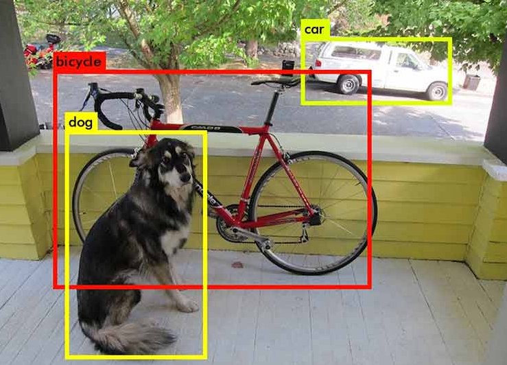
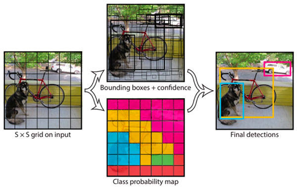
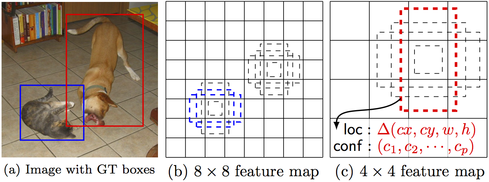

# Detecção de Objetos

Dada uma imagem que contém múltiplos objetos, desejamos classificar e localizar cada um desses
objetos presentes na imagem.

Podemos verificar na Figura 53 como funciona a detecção de objetos.

  

Figura 53: Representação de detecção de objetos. Percebe-se que, para cada um dos objetos na imagem, existe uma
<i>bounding box</i> localizando cada um dos objetos e para cada uma dessas <i>bounding boxes</i>, sua classificação.

Para isso, foram criados dois métodos principais de detecção de objetos em imagens _You Only Look Once_
(YOLO) e _Single Shot Detector_ (SSD).

Para YOLO, o método é essencialmente regressão, o qual usa uma imagem para aprender as possibilidades
das classes de acordo com as coordenadas das _bounding boxes_. YOLO divide cada imagem
em uma rede \\( SxS \\) e cada rede prevê \\( N \\) _bounding boxes_ e a confiança da precisão se cada
_bounding box_ realmente está contornando um objeto (Figura 54). Então, são previstas um total de \\( SxSxN \\)
_bounding boxes_ que, em sua maioria têm pontuações de confiança baixas e, portanto, podemos nos
livrar delas.

  

Figura 54: Representação de um algoritmo de detecção de objetos usando o método YOLO. A partir de uma imagem
de entrada, a dividimos em uma rede de tamanho \( SxS \) e, através de um algoritmo de regressão, encontramos as
coordenadas das <i>bounding boxes</i> e a confiança de que cada uma delas possui um objeto.

Por outro lado, SSD atinge um melhor equilíbrio entre rapidez e precisão. O SSD executa uma
ConvNet na imagem de entrada apenas uma vez e calcula um mapa de recursos (_feature map_). Agora,
executamos a convolução com um _kernel_ 3x3 para prever as _bounding boxes_ e as probabilidades de
categorização.

  

Figura 55: Representação de um algoritmo de detecção de imagens usando SSD. A partir de uma imagem de entrada,
através de uma ConvNet prevemos as coordenadas das <i>bounding boxes</i> com suas respectivas probabilidades, através
de apenas uma passagem pela rede para cada objeto.

